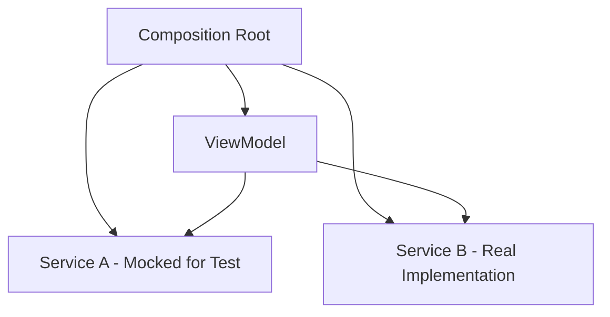

# Advantages (Fine-Grained Control)

Fine-grained control is a powerful benefit of Dependency Injection, allowing developers to manage the lifecycle, scope, and configuration of dependencies with high precision. This is particularly useful in complex iOS apps where different modules might need different variations of the same service.

## Scoping and Lifecycle Management

With DI, you can decide exactly how long a dependency should live. This is often managed via a **DI Container** or a **Composition Root**.

### Typical Scopes in iOS:
1.  **Transient/Factory**: A new instance is created every time it's requested.
2.  **Singleton/Global**: Only one instance exists for the entire app lifetime.
3.  **Graph/Scope**: One instance is shared within a specific flow (e.g., a "Login Flow" or a "Coordinator").

### Example: Different Scopes for a Logger
```swift
// A global logger for the whole app
let globalLogger = FileLogger(path: "/logs/app.log")

// A specialized logger for a specific feature with different configuration
let featureLogger = RemoteLogger(apiKey: "DEBUG_KEY", endpoint: .staging)

// Injecting the specific one needed
let viewModel = PaymentViewModel(logger: featureLogger)
```

## Contextual Configuration

DI allows you to inject dependencies that are pre-configured for a specific context. This avoids "God Objects" that try to handle every possible configuration internally.

### Problem: Internal Configuration Logic
```swift
class ImageLoader {
    let mode: LoaderMode
    
    init(mode: LoaderMode) {
        self.mode = mode
    }
    
    func load() {
        if mode == .highPerformance {
            // Complex internal branching
        } else {
            // ...
        }
    }
}
```

### Solution: Injecting the Behavior
By splitting the behaviors into fine-grained dependencies, the `ImageLoader` becomes simpler.

```swift
protocol CacheStrategy {
    func cache(_ image: UIImage)
}

class ImageLoader {
    let cache: CacheStrategy // Fine-grained control over caching behavior
    
    init(cache: CacheStrategy) {
        self.cache = cache
    }
}
```

## Behavioral Control in Testing

Fine-grained control is most visible during unit testing. You can inject a "fail-fast" dependency or a "delayed-response" dependency to test edge cases.

### Mermaid Diagram: Control Flow with DI


## Key Benefits
- **Reduced Side Effects**: By controlling precisely what an object interacts with, you minimize unexpected behavior.
- **Improved Performance**: Only initialize what you need, and reuse instances where appropriate.
- **Flexibility**: Swap complex behaviors without changing the core logic of the consuming class.

## Summary
Fine-grained control via Dependency Injection moves the decision-making about *how* a service should behave away from the service itself and into the orchestration layer of the application.
