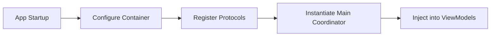

# Advantages (Flexibility, No Initializer Bloat)

While Dependency Injection is often associated with passing arguments to constructors, a well-designed DI system actually **increases flexibility** and **prevents initializer bloat** by using patterns like Property Injection or Dependency Injection Containers.

## Flexibility in Component Swapping

The greatest flexibility comes from injecting **Protocols** rather than concrete classes. This allows you to swap entire implementations based on the environment (Development, Staging, Production) or user state.

### Example: Environment Switching
```swift
protocol PaymentGateway {
    func process(amount: Double)
}

// Production Implementation
class StripeGateway: PaymentGateway { ... }

// Mock Implementation for local development
class MockPaymentGateway: PaymentGateway { ... }

// The View Controller doesn't care which one it gets
class CheckoutViewController: UIViewController {
    var gateway: PaymentGateway! 
}
```

## Addressing Initializer Bloat

A common criticism of basic constructor injection is that it can lead to massive `init` methods with 10+ parameters. Senior iOS Engineers avoid this using several strategies:

### 1. Grouping Related Dependencies
Instead of passing individual services, group them into a "Configuration" or "Context" object.

```swift
// Bloated Initializer
init(api: API, db: DB, auth: Auth, analytics: Analytics, logger: Logger, config: Config) { ... }

// Refactored with a Context
struct AppContext {
    let services: ServiceRegistry
    let themes: ThemeManager
}

init(context: AppContext) { ... }
```

### 2. Using DI Containers
A DI Container acts as a central registry. Objects can resolve their dependencies from the container without the parent object needing to know every detail.

```swift
// Using Swinject (Example)
let container = Container()
container.register(Networking.self) { _ in URLSession.shared }

// The dependency is resolved automatically or injected in one go
class HomeViewModel {
    @Injected var networking: Networking
}
```

## Comparisons of Injection Styles

| Style | Flexibility | Initializer Bloat | Use Case |
| :--- | :--- | :--- | :--- |
| **Constructor** | High | High | Mandatory dependencies, immutability. |
| **Property** | Medium | Low | Optional dependencies, Circular dependencies. |
| **Method** | Low | None | Task-specific dependencies (e.g., passing a database to a save method). |

## Visualizing the Flow


## Summary
Flexibility and clean initializers are not mutually exclusive. By leveraging protocols and advanced DI patterns like grouping or containers, you can maintain a clean codebase even in highly complex, multi-layered applications.
