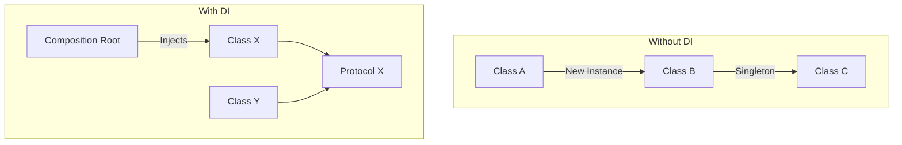

# Benefits of Dependency Injection

Dependency Injection (DI) is more than just a coding style; it is a fundamental architectural pattern that addresses the core challenges of software engineering: **Coupling**, **Testability**, and **Maintainability**.

## 1. Radical Testability
The single most immediate benefit of DI is the ability to write **Unit Tests** for your business logic. By injecting dependencies through protocols, you can replace real network calls, database operations, or hardware sensors with "Mocks" or "Stubs".

### Testing Example
```swift
func test_onLogin_callsAuthService() {
    // Arrange
    let mockAuth = MockAuthService()
    let sut = LoginViewModel(auth: mockAuth)
    
    // Act
    sut.login(username: "greg", password: "123")
    
    // Assert
    XCTAssertTrue(mockAuth.loginCalled)
}
```

## 2. Decoupling and Modularization
DI breaks the hard links between classes. This "loose coupling" allows you to:
-   Change a third-party library (e.g., swapping Alamofire for URLSession) in one place without touching every file.
-   Move a feature into a separate **Swift Package** by defining its needs as protocols.

## 3. Parallel Development
In a team environment, DI allows developers to work on different layers of the app simultaneously.
-   **Developer A** can work on the UI using a `MockDataService`.
-   **Developer B** can work on the actual `RESTDataService` implementation.
-   Since both adhere to the same protocol, they will integrate seamlessly later.

## 4. Cleaner Code (Separation of Concerns)
A class using DI is only responsible for its own logic. It doesn't need to know how to *create* a network client or *configure* a database; it just knows how to *use* them.

## High-Level Diagram: The Impact of DI


## Benefit Matrix

| Benefit | Impact on Developer | Impact on Project |
| :--- | :--- | :--- |
| **Testability** | Faster feedback loops | Higher code coverage / Less bugs |
| **Modularity** | Better code organization | Scalable codebase |
| **Maintainability** | Easier to read/understand | Lower cost of ownership |
| **Flexibility** | Ability to pivot/change | Future-proof architecture |

## Summary
At the senior level, DI is the "glue" that holds together Clean Architecture, MVVM, and VIPER. It ensures that the app remains a collection of small, focused, and testable components rather than a monolithic, brittle block of code.
