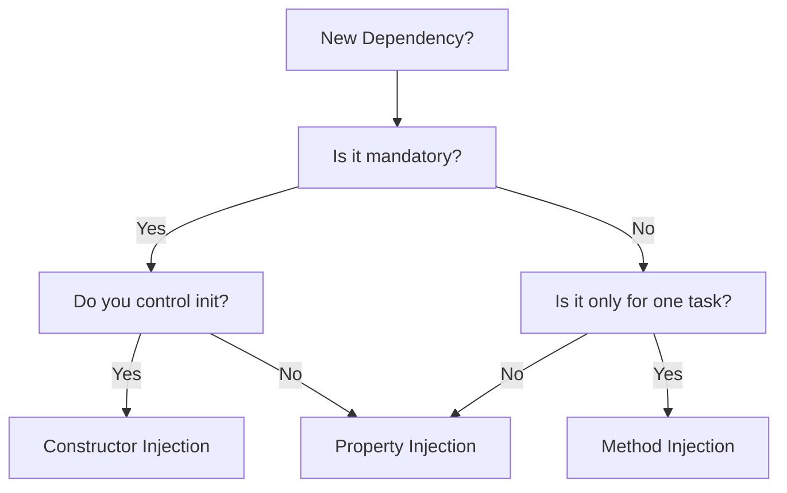

# Choosing the Right Pattern (Context Matters)

There is no "one size fits all" pattern for Dependency Injection. The best approach depends on the specific requirements of the object, its lifecycle, and the architectural context.

## Pattern Decision Guide

Use the following framework to decide which DI pattern to use:

### 1. Constructor (Initializer) Injection
This is the **Gold Standard**. Use it for everything unless there is a strong reason not to.
-   **When to use**: Mandatory dependencies, when you want immutability (using `let`), and for most ViewModels/Services.
-   **Pros**: Compile-time safety, guaranteed initialization, thread-safe.

### 2. Property (Setter) Injection
Use this when you don't have control over the initializer or when dependencies are optional.
-   **When to use**: `UIViewController` instances loaded from Storyboards/XIBs, or for "Circular Dependencies" that cannot be resolved via initializers.
-   **Pros**: Flexible, doesn't require initializer changes.
-   **Cons**: No compile-time guarantee the property is set, requires `var` (mutability).

### 3. Method Injection
Use this for dependencies that are only needed for a specific action, not for the lifetime of the object.
-   **When to use**: Passing a `ManagedObjectContext` to a save method, or passing a `User` object to a permission check.
-   **Pros**: Very granular, keeps the object state clean.

## Contextual Scenarios

### Scenario A: Complex View Hierarchy
If you have a deeply nested view hierarchy, passing dependencies down through every layer is called **"Prop Drilling"** and should be avoided.
-   **Solution**: Use a **DI Container** or **EnvironmentObjects** (in SwiftUI) to provide access to shared services without manual passing.

### Scenario B: Legacy Code Interop
When working with legacy Objective-C code or SDKs that rely on Singletons.
-   **Solution**: Create a **Wrapper Protocol**. Inject the wrapper instead of the singleton directly.

## Comparison Matrix

| Pattern | Immutability | Testing Ease | Boilerplate | Recommended for |
| :--- | :--- | :--- | :--- | :--- |
| **Constructor** | Yes | Excellent | Medium | Everything (Default) |
| **Property** | No | Good | Low | Storyboards / XIBs |
| **Method** | N/A | Excellent | Low | On-demand tasks |
| **Container** | Variable | Excellent | High | Modular apps / Deep trees |

## Flowchart: Which DI Pattern?

## Summary
Contextual awareness is the hallmark of a Senior Engineer. While **Constructor Injection** should be your default, knowing when to leverage **Property Injection** for UI objects or **Containers** for complex graphs is essential for a balanced architecture.
