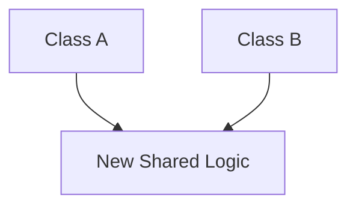

# Circular Dependencies

A circular dependency occurs when two or more components depend on each other directly or indirectly, creating a loop. In Dependency Injection (and Swift specifically), this is a critical issue as it can lead to **infinite loops** at initialization or **Retain Cycles** (Memory Leaks).

## How Circular Dependencies Occur
Imagine `Class A` needs `Class B`, and `Class B` needs `Class A`.


### The Initializer Trap
If both use Constructor Injection, neither can be created first.
```swift
class A { init(b: B) {} }
class B { init(a: A) {} }

// ERROR: Cannot instantiate 'A' because 'B' doesn't exist yet, 
// and cannot instantiate 'B' because 'A' doesn't exist yet.
```

## Solution 1: Property Injection
The most common way to break the circular loop is to move one of the dependencies to a property.

```swift
class A {
    let b: B
    init(b: B) { self.b = b }
}

class B {
    weak var a: A? // Break the loop and the retain cycle
    init() {}
}

// Resolution
let b = B()
let a = A(b: b)
b.a = a
```

## Solution 2: Common Dependency (Abstraction)
Often, a circular dependency is a sign of a design flaw. You can often break the loop by extracting the shared logic into a third component.



## Solution 3: Using a DI Container
DI Containers like **Swinject** can handle circular dependencies by performing injection in two phases (creation then property setting).

```swift
container.register(A.self) { r in
    A(b: r.resolve(B.self)!)
}
container.register(B.self) { r in
    let b = B()
    b.a = r.resolve(A.self)
    return b
}
```

## Memory Management (ARC)
In Swift, circular dependencies almost always lead to **Strong Reference Cycles**.
-   **Always** use `weak` or `unowned` on one side of the circular link to ensure that both objects can be deallocated.
-   **Warning**: If both are strong, they will never leave memory, causing a leak.

## Checklist for Fixing Circular Dependencies
1.  [ ] **Identify the loop**: Use Xcode's Memory Graph Debugger to find the cycle.
2.  [ ] **Check for Design Flaws**: Can the circular dependency be avoided by refactoring?
3.  [ ] **Apply Property Injection**: Convert one side to `weak var`.
4.  [ ] **Verify Deallocation**: Ensure `deinit` is called on both objects.

## Summary
Circular dependencies are often an "architectural smell" indicating that two classes are too tightly coupled. Whenever possible, refactor to remove the cycle; when not possible, use **Property Injection** combined with **weak references** to maintain safety and memory efficiency.
