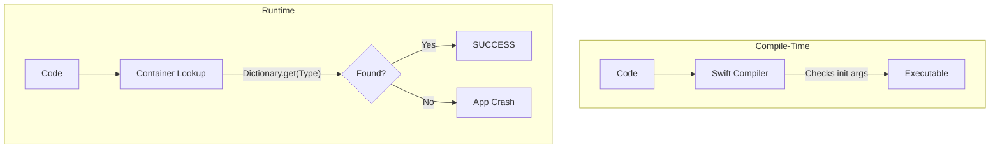

# Compile-Time vs. Runtime Dependency Resolution

One of the most important architectural choices in Dependency Injection is whether dependencies are checked at **Compile-time** (by the compiler) or **Runtime** (by the app while it's running).

## Compile-Time Resolution (Standard DI)

This is achieved using manual Constructor Injection. The Swift compiler verifies that all required arguments are provided before the app even builds.

### Pros:
-   **Safety**: Impossible to crash due to a "missing" dependency.
-   **Performance**: Zero overhead at runtime.
-   **Traceability**: "Command-Click" on a type takes you straight to the definition.

### Example:
```swift
class OrderViewModel {
    init(api: APIProtocol) { ... }
}

// The compiler errors here if APIProtocol is missing
let vm = OrderViewModel() // COMPILER ERROR
```

## Runtime Resolution (DI Containers)

This is common when using dynamic DI frameworks like Swinject. Dependencies are registered in a map and "resolved" when needed.

### Pros:
-   **Flexibility**: You can swap implementations dynamically.
-   **Scalability**: Reduces the need to pass dependencies through long "prop-drilling" chains.

### Example (Swinject):
```swift
container.register(APIProtocol.self) { _ in RealAPI() }

// This might crash at runtime if the registration is missing!
let api = container.resolve(APIProtocol.self)! 
```

## Comparison Table

| Feature | Compile-Time (Manual) | Runtime (Containers) |
| :--- | :--- | :--- |
| **Safety** | Guaranteed by Compiler | Risk of Runtime Crashes |
| **Feedback Loop** | Instant (Build Error) | Late (Crash during testing/use) |
| **Complexity** | High (lots of manual passing) | Low (automatic resolution) |
| **Performance** | Best (Native) | Slight overhead (Dictionary lookup) |
| **Best for** | Most projects / Unit testing | Large, modular applications |

## The "Hybrid" Approach (Needle / Weaver)
Frameworks like **Uber's Needle** or **Weaver** generate code at compile-time to provide the ease of a container with the safety of compiler checks. They use build-time scripts to ensure all dependency graphs are complete.

## Mermaid: Resolution Flow


## Strategy Recommendation
1.  **Small to Medium Apps**: Stick with **Compile-Time** manual injection. It's safer and easier to maintain.
2.  **Large, Modular Apps**: Use a **DI Container** to avoid initializer hell, but invest in **Unit Tests** that verify the container's configuration.
3.  **Strict Safety Needs**: Use tool-backed DI (Needle) if you want the best of both worlds.

## Summary
As a Senior Engineer, you must weigh the convenience of runtime resolution against the absolute safety of compile-time checks. Most modern iOS development favors compile-time safety to minimize the risk of production crashes.
