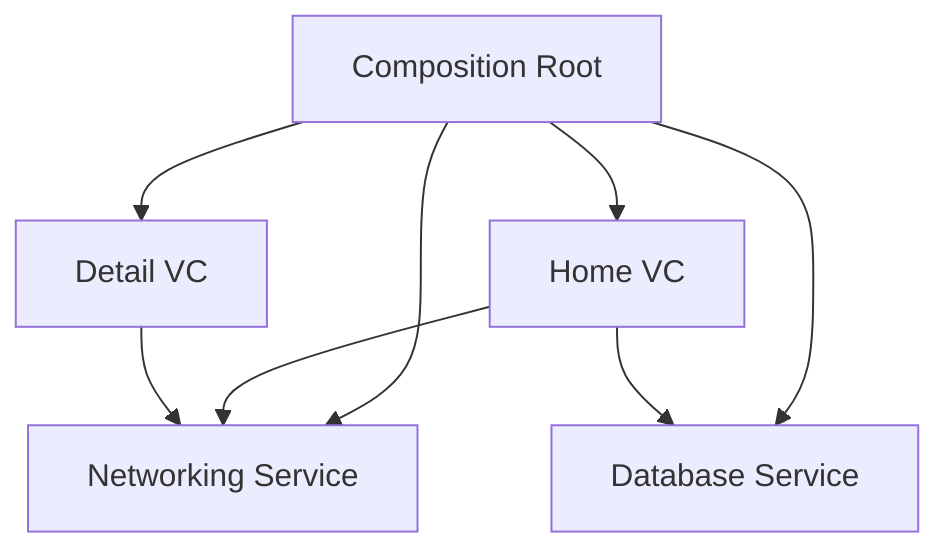

# Composition Root

The **Composition Root** is a unique location in an application where the dependency graph is composed. In a well-architected iOS app, this is the *only* place where concrete classes are instantiated and wired together.

## Why use a Composition Root?
Without a central root, instantiation logic is scattered throughout the app. Classes start creating their own dependencies, leading to tight coupling and poor testability.

### The Goal:
-   **Business Logic**: Only contains protocols and logic. No `init()` of other services.
-   **Composition Root**: Contains the "Dirty" details of which exact classes to use.

## Where is the Composition Root in iOS?

Depending on your architecture, the root is usually one of the following:

1.  **AppDelegate / SceneDelegate**: For simple apps.
2.  **AppCoordinator**: In apps using the Coordinator pattern.
3.  **DI Container Configuration**: In apps using Swinject or similar.

## Implementation Example

In this example, the `AppCoordinator` acts as the composition root for the entire app.

```swift
class AppCoordinator {
    let window: UIWindow
    
    // Core services are instantiated here ONCE
    private let apiClient = RealNetworkClient()
    private let database = CoreDataStack()
    
    init(window: UIWindow) {
        self.window = window
    }
    
    func start() {
        // Wiring dependencies into the first view controller
        let viewModel = HomeViewModel(api: apiClient, db: database)
        let rootVC = HomeViewController(viewModel: viewModel)
        
        window.rootViewController = rootVC
        window.makeKeyAndVisible()
    }
}
```

## Benefits of the Composition Root

### 1. Centralized Configuration
Changing the networking library or the database implementation happens in one file.

### 2. Improved Testing
Since all wiring is centralized, you can easily create a "Test Composition Root" that wires everything with mocks.

### 3. Clear Ownership
The root clearly owns the long-lived services, preventing memory management confusion. (e.g., Who owns the `URLSession`? The Root does.)

## Visualizing the Architecture


## Critical Rules
-   **No Newing**: Business logic classes should never use the `new` or `init()` keyword for other service-level classes.
-   **Protocol Only**: Components should only know about their dependencies via protocols.
-   **Top-Down**: Dependencies should flow from the Root down into the leaf nodes of the app.

## Summary
The Composition Root is the "brain" of your application's structure. By isolating the instantiation logic, you protect your business logic from implementation details and ensure your app remains easy to refactor and test.
