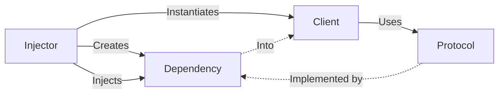

# Core Concepts

Dependency Injection (DI) is built upon several core concepts that every Senior iOS Engineer should master. These terms form the vocabulary of modern software architecture.

## 1. The Dependency
A dependency is any object or service that a class requires to perform its job. 
-   **Example**: A `ViewModel` depends on an `APIService`.

## 2. Inversion of Control (IoC)
IoC is the broader principle where a class *gives up control* of creating its dependencies. instead of the class saying "I will create my network client," it says "I expect someone to provide me with a network client."

## 3. The Protocol (The Interface)
Protocols are the "contracts" that separate what a dependency *does* from how it *is implemented*. In DI, we almost always inject protocols.

```swift
protocol Storage {
    func save(data: Data)
}
```

## 4. The Injector (The Assembler)
The injector is the entity responsible for creating the dependency and passing it to the object that needs it. This could be a manual factory, a coordinator, or a DI container.

## 5. The Injectee (The Client)
The object that receives the dependencies. It is "injected" with the tools it needs.

## 6. The Composition Root
The single entry point of the application where all dependencies are wired together.

## Visual Relationship


## Key Terminology Comparison

| Term | Analogy | Context in iOS |
| :--- | :--- | :--- |
| **Dependency** | The tools a plumber needs | `URLSession`, `CLLocationManager` |
| **Injectee** | The plumber | `HomeViewModel`, `MapViewController` |
| **Injector** | The dispatcher who gives tools | `AppCoordinator`, `Swinject.Container` |
| **Protocol** | The plumbing blueprint | `NetworkServiceProtocol` |

## Summary
Understanding these core concepts allows you to move beyond simply "passing variables" and start thinking about your application as a graph of cooperating components. This perspective is vital for implementating patterns like Clean Architecture and SOLID.
