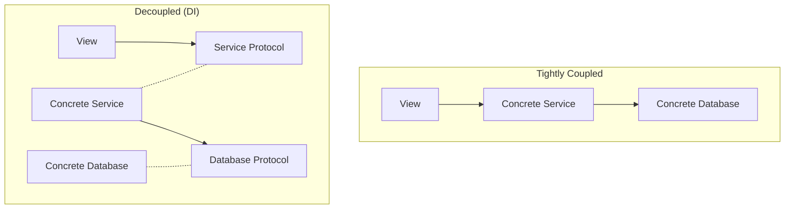

# Decoupling

Decoupling is the process of reducing the dependencies between components so that changes in one don't require changes in others. Dependency Injection is the primary tool used to achieve decoupling in iOS applications.

## Tight Coupling (The Problem)
When two classes have hard links to each other, they are "tightly coupled."

### Example of Tight Coupling:
```swift
class OrderLogger {
    func log(message: String) { print(message) }
}

class OrderProcessor {
    let logger = OrderLogger() // Processor is TIED to Logger
    
    func process() {
        logger.log(message: "Processing...")
    }
}
```
**Why this is bad**: You cannot test `OrderProcessor` without also running `OrderLogger`. If you change `OrderLogger` to write to a database, the `OrderProcessor` might break.

## Loose Coupling (The Solution)
Using DI and Protocols, we can decouple the components.

### Example of Loose Coupling:
```swift
protocol LoggerProtocol {
    func log(message: String)
}

class OrderProcessor {
    let logger: LoggerProtocol // Processor only knows the CONTRACT
    
    init(logger: LoggerProtocol) {
        self.logger = logger
    }
}
```
**Why this is better**:
1.  **Testability**: You can inject a `MockLogger` for tests.
2.  **Flexibility**: You can swap `ConsoleLogger` with `AnalyticsLogger` without touching `OrderProcessor`.
3.  **Isolation**: The `OrderProcessor` can be moved to a different module/package easily.

## Degrees of Coupling

| Type | Linkage | Flexibility | Testability |
| :--- | :--- | :--- | :--- |
| **Monolithic** | Direct `init()` calls | Zero | Extremely Hard |
| **Singleton** | `Shared` instances | Low | Hard (State persists) |
| **DI (Concrete)** | Injected classes | Medium | Medium (Hard to mock) |
| **DI (Protocol)** | Injected Protocols | High | Excellent |

## Visualizing Decoupling


## Summary
Decoupling isn't just about making things "loose"; it's about defining **boundaries**. Dependency Injection ensures that your high-level business rules don't depend on low-level implementation details, which is the cornerstone of the **Dependency Inversion Principle**.
