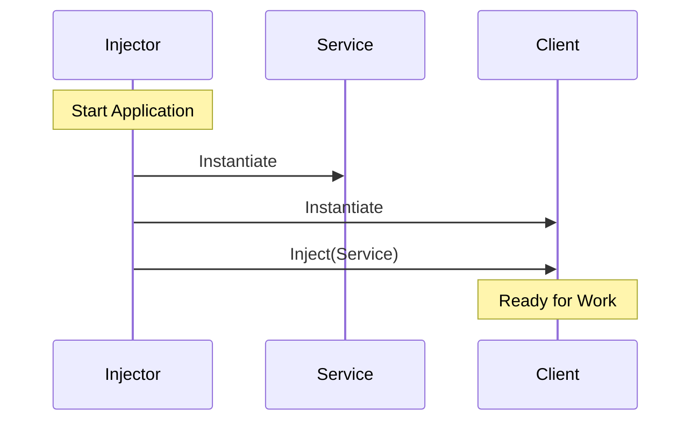

# Definition of Dependency Injection

At its simplest level, **Dependency Injection (DI)** is a technique where one object supplies the dependencies of another object. Instead of an object constructing its own dependencies, they are "injected" into it from the outside.

## Formal Definition
Dependency Injection is a design pattern that implements **Inversion of Control** for resolving dependencies. It allows a program design to follow the **Dependency Inversion Principle**, where high-level modules do not depend on low-level modules, but both depend on abstractions.

## The Three Roles of DI
To understand DI, you must identify three key players:

1.  **The Client (Injectee)**: The object that needs something.
2.  **The Service (Dependency)**: The object that provides a function.
3.  **The Injector (Assembler)**: The piece of code that connects the Service to the Client.

## Conceptual Example
Imagine a `Car` and an `Engine`.

### Without DI (Hard-coded)
The `Car` creates its own `Engine`. It is now stuck with a gas engine and cannot be easily tested or changed.
```swift
class Car {
    let engine = GasEngine() // Dependency is created internally
}
```

### With DI (Injected)
The `Car` expects an `Engine` to be provided. It can now work with any type of engine (Electric, Gas, Mock).
```swift
class Car {
    let engine: EngineProtocol
    
    init(engine: EngineProtocol) {
        self.engine = engine
    }
}
```

## DI in the iOS Stack
In the context of iOS development, DI is typically used to provide:
-   **Services**: Networking, Databases, Analytics.
-   **Data**: User models, Configuration objects.
-   **UI Components**: Injecting child ViewControllers or Coordinators.

## Visualizing the Injection


## Summary
Dependency Injection is often made to sound more complicated than it is. Ultimately, it is the practice of **passing parameters to an object's initializer or properties** instead of letting the object create its own helpers. This simple shift in control is the foundation of professional-grade iOS architecture.
