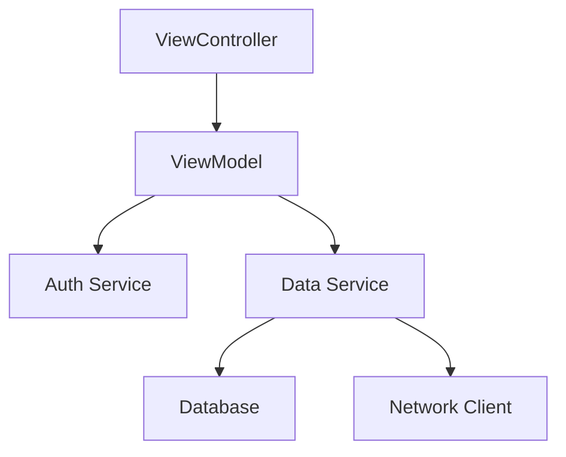

# Dependency (An object that another object needs)

In software engineering, a **dependency** is a broad term used to describe any object, service, or piece of data that a class requires to fulfill its purpose. If `Class A` cannot function correctly without `Class B`, then `Class B` is a dependency of `Class A`.

## Types of Dependencies in iOS

Dependencies come in many forms. Recognizing them is the first step toward effective Dependency Injection.

### 1. External Services (The most common)
Services that interact with the outside world.
-   **Networking**: `APIService`, `GraphQLClient`.
-   **Persistence**: `CoreDataStack`, `UserDefaults`.
-   **Hardware**: `CLLocationManager`, `AVAudioPlayer`.

### 2. Domain Data
Objects that hold the state of your application.
-   **Models**: `User`, `Account`, `Configuration`.
-   **Context**: `AppTheme`, `UserPreferences`.

### 3. Logic Helpers
Small objects that perform specific calculations or formatting.
-   **Formatters**: `DateFormatter`, `CurrencyFormatter`.
-   **Validation**: `FormValidator`, `RegexHelper`.

## Identifying a Dependency

Ask yourself: **"Can I unit test this class in isolation?"**
-   If the class calls `URLSession.shared` or `FileManager.default`, it has a **hidden dependency**.
-   If the class creates a `new DatabaseConnector()`, it has a **hard-coded dependency**.

## The Dependency Chain
Dependencies often form a "tree" or a "graph".

In this diagram:
-   `Auth Service` is a dependency of `ViewModel`.
-   `Network Client` is a dependency of `Data Service`.

## Why Distinguish Dependencies?
As a Senior Engineer, you should distinguish between:
-   **Mandatory Dependencies**: The object *can't live* without them (Inject via `init`).
-   **Optional Dependencies**: The object can have them, or use a default (Inject via properties).
-   **Ephemeral Dependencies**: Only needed for a specific method execution (Inject via method parameters).

## Summary
A dependency is essentially a "helper" that a class uses to get its work done. By identifying these helpers and treating them as external requirements rather than internal details, you unlock the ability to mock, swap, and scale your code effectively.
