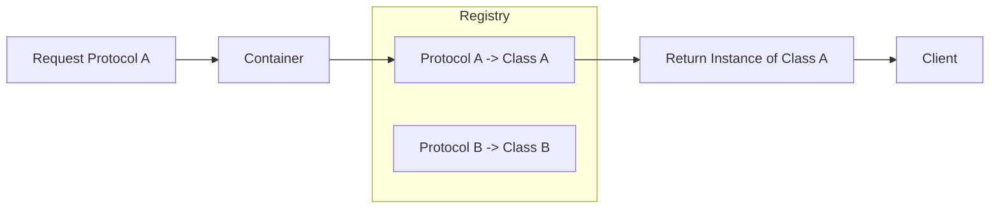

# Dependency Injection Containers & Frameworks

A **Dependency Injection Container** (or Service Container) is a library or object that automates the process of instantiating and injecting dependencies. While manual DI is often preferred for smaller apps, Containers become valuable as the app's complexity grows.

## What is a DI Container?
Essentially, a container is a **registry** that maps a protocol (or type) to a concrete implementation. When you need a dependency, you ask the container to "resolve" it for you.

### Registration Phase:
```swift
container.register(NetworkingProtocol.self) { _ in 
    RealNetworkClient() 
}
```

### Resolution Phase:
```swift
let service = container.resolve(NetworkingProtocol.self)
```

## Popular iOS DI Frameworks

| Framework | Mechanism | Safety | Learning Curve |
| :--- | :--- | :--- | :--- |
| **Swinject** | Runtime Lookup (Dictionary) | Low (Runtime crashes) | Easy |
| **Uber Needle** | Compile-Time Generative | High (Type-safe) | Steep |
| **Weaver** | Compile-Time Generative | High (Type-safe) | Medium |
| **Factory** | Swift 5.1+ Property Wrappers | Medium | Very Easy |

## Pros and Cons of using Frameworks

### Pros:
-   **Reduced Boilerplate**: No need to pass dependencies through 5 layers of initializers.
-   **Centralized Config**: All service configurations live in one registry.
-   **Automated Scoping**: Most containers handle Singleton vs. Instance scopes automatically.

### Cons:
-   **Implicit Dependencies**: You lose the clarity of the initializer (unless using generative DI).
-   **Runtime Crashes**: If you forget to register a dependency in Swinject, the app will crash at runtime.
-   **Vendor Lock-in**: Your code becomes dependent on a third-party library.

## Best Practice: Using a Container without the Framework
You can often implement a simple "Container" using a plain Swift `struct`.

```swift
struct DependencyContainer {
    static let shared = DependencyContainer()
    
    let networking: NetworkingProtocol = RealNetworkClient()
    let database: StorageProtocol = CoreDataStorage()
}

// Injected manually
let vm = HomeViewModel(api: DependencyContainer.shared.networking)
```

## Visualizing Container Resolution


## Summary
DI Containers are powerful tools for managing the orchestration of large systems. For Senior Engineers, the key is to choose the *least intrusive* tool that provides the necessary level of safety. **Manual DI** is best for safety, while **Generative DI (Needle)** is best for large-scale modularity.
