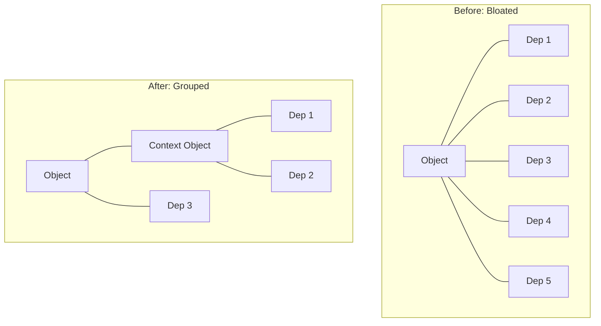

# Disadvantages (Initializer Bloat)

One of the most frequent complaints about manual Dependency Injection is **Initializer Bloat**. This occurs when a class requires a large number of dependencies, leading to an unwieldy and hard-to-read initializer.

## The Symptoms of Bloat
A bloated initializer often looks like a wall of text, making the class initialization complex and discouraging developers from adding necessary services.

```swift
class MassiveViewModel {
    init(
        api: APIService,
        storage: Storage,
        analytics: Analytics,
        localization: Localizer,
        theme: ThemeManager,
        router: Router,
        auth: AuthService,
        logger: Logger
    ) { ... }
}
```

## Why it Happens
Initializer bloat is usually a symptom of a **violation of the Single Responsibility Principle (SRP)**. If a class needs 10 dependencies, it is likely doing too many different things.

## Strategies to Resolve Bloat

### 1. Refactor for Single Responsibility
Break the massive class into several smaller, more focused classes.
-   **Example**: Split `MassiveViewModel` into `UserViewModel`, `PaymentViewModel`, and `SettingsViewModel`.

### 2. Grouping Dependencies (The Context Pattern)
Group related dependencies into a container struct.

```swift
struct ServiceContext {
    let api: APIService
    let storage: Storage
    let logger: Logger
}

class RefactoredViewModel {
    init(context: ServiceContext, auth: AuthService) { ... }
}
```

### 3. Use Facades
Create a wrapper object that handles multiple low-level dependencies and provides a simplified interface.

```swift
class AnalyticsFacade {
    init(firebase: Firebase, adjustable: Adjust, appsFlyer: AppsFlyer) { ... }
    func track(event: Event) { ... }
}
```

## Trade-offs of Bloat vs. Alternatives

| Aspect | Bloated Initializer | Grouped Context | DI Container / Wrapper |
| :--- | :--- | :--- | :--- |
| **Visibility** | High (Honest) | Medium | Low (Hidden) |
| **Boilerplate** | High | Low | Very Low |
| **Readability** | Poor | Good | Excellent |
| **Architecture** | Brittle | Flexible | Decoupled |

## Visualizing the Refactoring


## Summary
Initializer bloat shouldn't be blamed on Dependency Injection itself, but rather viewed as a **warning sign** that a class is becoming too complex. Before reaching for a DI framework to hide the bloat, first consider if the class should be broken down into smaller, more manageable pieces.
