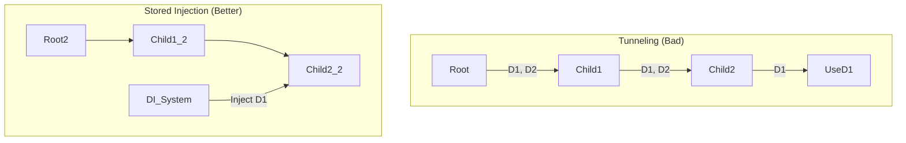

# Disadvantages (Method Signature Bloat)

**Method Signature Bloat** occurs when Method Injection is overused, resulting in functions that require an excessive number of parameters to perform their tasks.

## The Problem
When every function in a call chain requires unique dependencies, those dependencies must be passed down through every layer, even if intermediate layers don't use them. This is often termed **"Dependency Tunneling"**.

### Example of Tunneling:
```swift
func level1(api: API, db: DB) { level2(api: api, db: db) }
func level2(api: API, db: DB) { level3(api: api, db: db) }
func level3(api: API, db: DB) { 
    // Finally uses db here
    db.save(...) 
}
```

## Why it's Harmful
1.  **Noise**: The important business logic is buried under a mountain of parameter passing.
2.  **Refactoring Difficulty**: Adding a single dependency to the bottom layer requires updating every signature in the chain.
3.  **Violates Abstraction**: Intermediate layers are forced to know about dependencies they don't even use.

## Solutions

### 1. Re-evaluate Lifetimes
If a dependency is used across multiple methods, perhaps it should be a **Class-level Stored Dependency** injected via the initializer instead of a method parameter.

### 2. Context Objects
Pass a single "Environment" or "TaskContext" object that contains the necessary tools. This is common in functional programming and Redux-like architectures.

```swift
struct TaskContext {
    let api: API
    let db: DB
}

func level1(context: TaskContext) { level2(context: context) }
```

### 3. Partial Application / Currying
In functional contexts, you can pre-fill certain arguments (like dependencies) and return a new function that only takes the actual data.

```swift
func buildSaveAction(db: DB) -> (User) -> Void {
    return { user in db.save(user) }
}
```

## Visual Comparison: Tunneling vs. Direct Injection


## Summary
Method Signature Bloat is a sign that the "Injection Point" is too high or the "Dependency Scope" is wrongly defined. While method injection is great for one-off tasks, overusing it can turn your codebase into a maintenance nightmare. Always strive for a balance between explicit passing and architectural storage.
