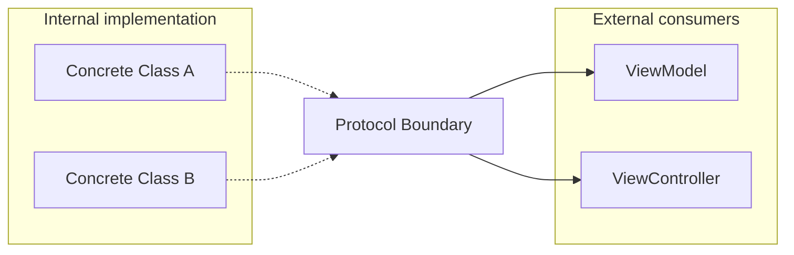

# Easier Maintenance and Refactoring

Dependency Injection (DI) is one of the most effective tools for ensuring that an iOS application remains maintainable and easy to refactor as it grows. By decoupling components, you minimize the "ripple effect" of changes.

## 1. Reducing the Ripple Effect
In a tightly coupled app, changing a single class can break dozens of other classes that depend on it. With DI, since classes depend on **Protocols**, you can change the underlying implementation without touching the consuming code.

### Example: Swapping a Database
Imagine you want to move from **CoreData** to **SwiftData**.

-   **Without DI**: You have to find every place `NSManagedObjectContext` is used and rewrite it.
-   **With DI**: You update the concrete class that implements `StorageProtocol` and swap it in the **Composition Root**. The rest of the app never knows the difference.

```swift
protocol Storage {
    func saveUser(_ user: User)
}

// Old
class CoreDataStorage: Storage { ... }

// New (Refactored)
class SwiftDataStorage: Storage { ... }

// Composition Root (Only change needed)
let storage: Storage = SwiftDataStorage()
```

## 2. Safe Deletion of Code
DI makes it clear which components are actually being used. If you remove a registration from your DI container or a parameter from an initializer, the compiler will tell you exactly where the gaps are.

## 3. Simplified Upgrades
Upgrading third-party libraries is much safer with DI. You can wrap the library in a local protocol (The **Adapter Pattern**). When the library is updated (or replaced), you only update the Adapter.

-   **Scenario**: Upgrading from Alamofire 4 to 5.
-   **Solution**: Only the `AlamofireNetworkAdapter` needs to change; the ViewModels remain untouched.

## 4. Facilitating "A/B Testing" of Features
DI allows you to easily run different versions of a feature simultaneously.

```swift
let useNewFeature = FeatureFlag.isEnabled(.newAlgorithm)
let algorithm: Algorithm = useNewFeature ? NewAlgorithm() : OldAlgorithm()

let viewModel = HomeViewModel(algorithm: algorithm)
```

## Refactoring Metrics Comparison

| Metric | With DI | Without DI |
| :--- | :--- | :--- |
| **Files touched per change** | Very Few | Many |
| **Unit Test updates** | Minimal | High |
| **Risk of Regression** | Low | High |
| **Developer Confidence** | High | Low |

## Visualization: The "Firewall" of Protocols


## Summary
Refactoring is a constant in the life of a professional developer. Dependency Injection acts as a "buffer" between your components, allowing you to improve, update, and replace parts of your system with surgical precision and minimal risk.
