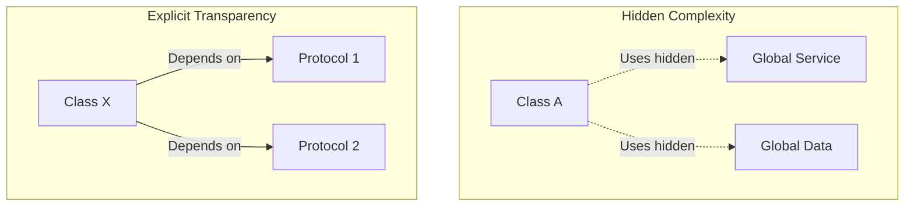

# Enhanced Code Readability and Understandability

Dependency Injection (DI) significantly improves the readability of an iOS codebase by making it "honest." An honest class is one that clearly declares its dependencies and purpose.

## 1. "Honest" Classes vs. "Dishonest" Classes

### The Dishonest Class
Looking at this class, you have no idea that it accesses the Keychain, tracks analytics, or makes network requests until you read every line of its implementation.
```swift
class OrderViewModel {
    init() {} // Looks simple, but it's LYING!
    
    func submit() {
        Keychain.shared.getToken()
        Analytics.shared.send("Click")
        API.shared.postOrder()
    }
}
```

### The Honest Class (DI)
Looking at this class, you know *exactly* what its capabilities and requirements are just by reading the initializer.
```swift
class OrderViewModel {
    init(auth: TokenProvider, analytics: Tracker, api: OrderService) { ... }
}
```

## 2. Improved Code Discovery
When dependencies are explicit, new developers can use **Xcode's Jump to Definition** (Cmd-Click) on the initializer to understand how a class interacts with the rest of the system. In a system full of Singletons, discovery requires searching the entire project for global references.

## 3. Clear Intent
DI separates **WHAT** a class does from **HOW** it gets its resources. This separation allows the reader to focus on the business logic without being distracted by configuration code.

### Logic is Clearer:
```swift
func processOrder() {
    // We focus on the FLOW
    let user = auth.currentUser
    api.submit(order, for: user)
}
```

## 4. Standardized Patterns
Once a team adopts a consistent DI strategy (like always using Constructor Injection), the codebase becomes predictable. A developer joining the project knows exactly where to look to see how a feature is wired up (**The Composition Root**).

## Readability Comparison Summary

| Feature | Using Singletons / Globals | Using Dependency Injection |
| :--- | :--- | :--- |
| **Discovery** | Hard (requires searching) | Easy (check `init`) |
| **Logic Clarity** | Low (mixed with config) | High (pure business logic) |
| **Integration** | Opaque | Transparent |
| **Predictability** | Low (hidden side effects) | High (explicit requirements) |

## Mermaid Diagram: Transparency in DI


## Summary
Code is read much more often than it is written. By using Dependency Injection, you provide future developers (including yourself) with a clear, self-documenting map of how your application functions. Transparency leads to trust, and trust leads to faster, safer development.
