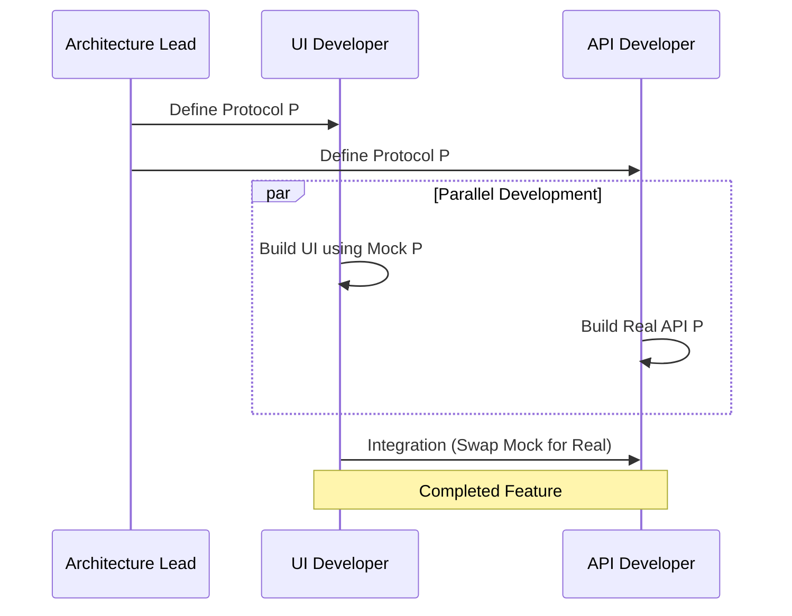

# Facilitates Parallel Development

In a Senior engineering role, you are often responsible for coordinating work across multiple developers or teams. Dependency Injection (DI) is a critical enabler for **Parallel Development**, allowing team members to work on different parts of a system simultaneously without stepping on each other's toes.

## 1. Programming to Interfaces (Protocols)
By defining a protocol first, two developers can agree on a "contract" before any implementation is written.

### Example: The Weather App
-   **Developer A**: Responsible for the UI.
-   **Developer B**: Responsible for the API integration.

They both agree on:
```swift
protocol WeatherProvider {
    func getForecast(completion: @escaping (Forecast) -> Void)
}
```

## 2. Unblocking the UI Team
Developer A doesn't have to wait for Developer B to finish the network layer. They can create a `MockWeatherProvider` and start building the UI immediately with predictable data.

```swift
class MockWeatherProvider: WeatherProvider {
    func getForecast(completion: @escaping (Forecast) -> Void) {
        completion(Forecast(temp: 72, condition: .sunny))
    }
}
```

## 3. Simultaneous Layer Development
DI allows the development of multiple layers of the app at once:
-   **Team 1**: Database/Persistence layer.
-   **Team 2**: Business Logic / ViewModels.
-   **Team 3**: UI / Design System.

Each team works against protocols provided by the layer below them.

## 4. Reducing Merge Conflicts
In a tightly coupled system, multiple people often need to touch the same "core" files (like a shared Network singleton). With DI, each developer works on their own concrete implementation of a protocol, and the only "shared" touchpoint is the **Composition Root**.

## Parallel Workflow Diagram


## Benefits for Team Velocity

| Feature | Impact on Team | Result |
| :--- | :--- | :--- |
| **Contract-First** | Lowers communication overhead | Faster start |
| **Mocking** | Eliminates wait times | No "blocked" tasks |
| **Isolation** | Reduces dependency on backend availability | Continuous work |
| **Swappability** | Easy integration at the end | Lower risk of merge hell |

## Summary
Dependency Injection turns a sequential development process into a parallel one. As a lead engineer, you can increase team velocity by ensuring that features are architected around protocols, allowing every member of the team to contribute at their own pace without being blocked by technical dependencies.
