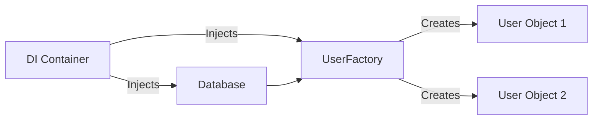

# Factories and Builders (Creating Complex Objects)

When objects become complex or have dynamic initialization logic, simply passing dependencies to an initializer might not be enough. In these cases, **Factories** and **Builders** are used to bridge the gap between Dependency Injection and complex object creation.

## 1. The Factory Pattern
A Factory is an object responsible for creating other objects. In a DI context, a Factory is often injected into a class so that the class can create "ephemeral" or "short-lived" dependencies on demand.

### Why use a Factory with DI?
If `Class A` needs to create multiple instances of `Class B` at runtime (e.g., in response to user clicks), it shouldn't `init()` them directly. Instead, it should use a Factory.

```swift
protocol ViewControllerFactory {
    func makeDetailViewController(for item: Item) -> UIViewController
}

class ListViewController: UIViewController {
    let factory: ViewControllerFactory // Injected
    
    func onItemSelected(_ item: Item) {
        let detailVC = factory.makeDetailViewController(for: item)
        navigationController?.pushViewController(detailVC, animated: true)
    }
}
```

## 2. The Builder Pattern
The Builder pattern is used to construct a complex object step-by-step. In DI, a Builder can be used to assemble a complicated dependency graph before passing the final product to the consumer.

### Example: Network Request Builder
```swift
class RequestBuilder {
    private var url: URL?
    private var headers: [String: String] = [:]
    
    func setUrl(_ url: URL) -> RequestBuilder { ... }
    func addHeader(_ key: String, value: String) -> RequestBuilder { ... }
    
    func build(using session: URLSession) -> NetworkRequest {
        return NetworkRequest(url: url!, headers: headers, session: session)
    }
}
```

## 3. Dependency Injection in Factories
A well-designed Factory should itself be injected with the dependencies needed to create its products.



## Factory vs. Builder vs. DI Container

| Pattern | Primary Purpose | Lifecycle |
| :--- | :--- | :--- |
| **DI Container** | Resolve the global graph | App-wide / Scope-wide |
| **Factory** | Create multiple instances of the same type | On-demand (Transient) |
| **Builder** | Step-by-step configuration of one object | Single creation task |

## Best Practices
1.  **Inject your Factories**: Don't use static factories; they are just disguised singletons.
2.  **Keep Factories focused**: A factory should create one type of object or a small related group of objects.
3.  **Closures as Factories**: In Swift, a simple closure can often replace a full Factory class.
    - `let factory: (Item) -> DetailVC` is often cleaner than a protocol.

## Summary
Factories and Builders extend the power of Dependency Injection by handling specialized creation logic. They allow your business logic to stay clean while still being able to create complex, fully-dependency-injected objects whenever they are needed.
