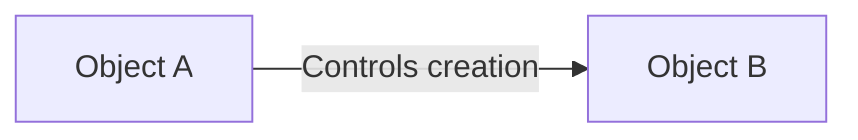
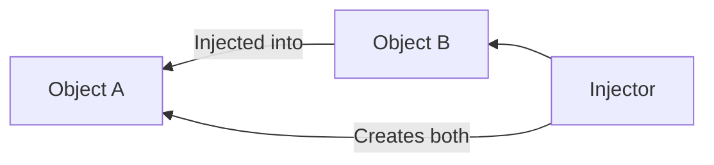

# How DI Solves Coupling (Inversion of Control)

At the heart of Dependency Injection is a concept called **Inversion of Control (IoC)**. Understanding how this principle solves tight coupling is essential for any senior engineer.

## The Traditional Approach (Low Control)
In traditional programming, a class is responsible for its own logic AND for managing its own resources (dependencies).



### Problem: Tight Coupling
If `Object A` creates `Object B`, it is now "coupled" to that specific implementation. If `Object B` changes its initializer, `Object A` must also change. This makes `Object A` brittle, hard to test, and impossible to reuse without `Object B`.

## The Inversion (High Control)
With IoC, we **invert** this relationship. `Object A` is no longer responsible for creating `Object B`. Instead, it simply defines that it *needs* something like `Object B`.



## How DI specifically solves this:

### 1. The "Push" instead of "Pull"
Instead of `Object A` reaching out into the global scope to "pull" a dependency (like a singleton), the system "pushes" the dependency into `Object A`.

### 2. Abstraction as the Middleman
By injecting a **Protocol** instead of a concrete class, we break the direct link completely. `Object A` now depends on a *behavior*, not an *implementation*.

```swift
// Tightly Coupled
class Processor {
    let logger = ConsoleLogger() 
}

// Inverted & Decoupled
class Processor {
    let logger: LoggerProtocol // Only depends on abstraction
    init(logger: LoggerProtocol) { self.logger = logger }
}
```

## The "Hollywood Principle"
IoC is often summarized by the Hollywood Principle: **"Don't call us, we'll call you."**
-   The component doesn't call a constructor.
-   The framework/injector calls the component with the required tools.

## Summary of Coupling Benefits

| Feature | Hard-coded Logic | Inversion of Control |
| :--- | :--- | :--- |
| **Linkage** | Concrete Class | Protocol / Interface |
| **Responsibility** | Logic + Resource Mgmt | Business Logic only |
| **Scalability** | Brittle | Flexible |
| **Unit Testing** | Impossible (Integrated) | Trivial (Isolated) |

## Summary
Inversion of Control via Dependency Injection is the mechanism that allows us to build modules that are truly independent. It shifts the burden of configuration to a higher level of the app, leaving the core business logic pure and focused.
