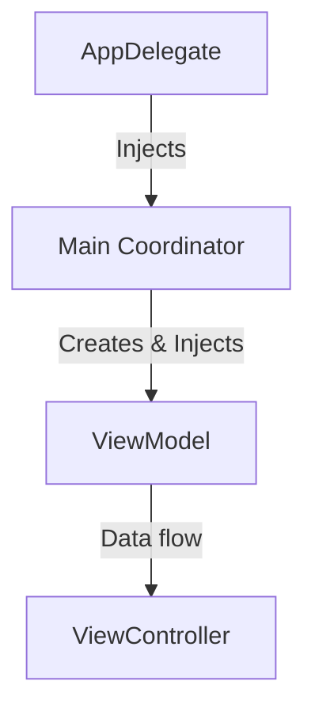

# Implementing Dependency Injection in iOS

Implementing Dependency Injection (DI) in an iOS environment requires a slightly different approach than in server-side development, primarily due to the unique lifecycle of `UIViewController` and the emergence of SwiftUI.

## 1. Initializer Injection (The Default)
In standard Swift classes (ViewModels, Coordinators, Services), use Initializer Injection as your primary tool.

```swift
class MyService {
    private let client: APIClient
    init(client: APIClient = .shared) {
        self.client = client
    }
}
```

## 2. Property Injection for ViewControllers
When using Storyboards or XIBs, you cannot use custom initializers. In these cases, use **Property Injection**.

```swift
class MyViewController: UIViewController {
    var viewModel: MyViewModel! // Injected after instantiation
}

// In the Coordinator or Segue handler:
let vc = storyboard.instantiateViewController(...) as! MyViewController
vc.viewModel = MyViewModel(api: api) 
```

## 3. DI in SwiftUI
SwiftUI introduces `@Environment` and `@EnvironmentObject`, which are first-class DI mechanisms built into the framework.

```swift
struct MyView: View {
    @EnvironmentObject var settings: UserSettings
    
    var body: some View {
        Text(settings.username)
    }
}
```

## 4. The Path of Data: Initializer -> Coordinator -> View
In a professional architecture (like MVVM-C), dependencies flow through a specific path:



## 5. Working with Framework-Driven Initializers
Some Apple frameworks (like `CLLocationManagerDelegate`) expect you to be the delegate. Use DI to inject the "Handler" for those delegate callbacks.

```swift
class LocationService: NSObject, CLLocationManagerDelegate {
    let onUpdate: (CLLocation) -> Void
    
    init(onUpdate: @escaping (CLLocation) -> Void) {
        self.onUpdate = onUpdate
    }
}
```

## Implementation Checklist
1.  **Define Protocol**: Start by abstracting your service.
2.  **Declare Dependencies**: Add them to the `init` of the consuming class.
3.  **Assign at Root**: Instantiate and pass the service in the `SceneDelegate` or `Coordinator`.
4.  **Avoid Singletons**: Remove `shared` references from within the class implementation.

## Summary
Implementing DI in iOS is about choosing the right tool for the specific component lifecycle. Whether it's traditional initializer injection for logic, property injection for UIViews, or EnvironmentObjects for SwiftUI, the goal remains the same: **Externalize the dependencies**.
