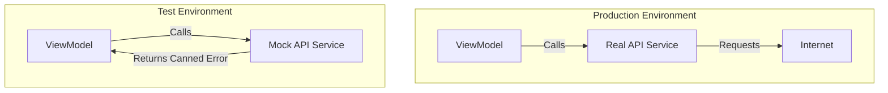

# Improved Testability (Mocking and Stubbing)

The single greatest driver for adopting Dependency Injection in iOS is the ability to write reliable **Unit Tests**. Without DI, your tests are "Integrations Tests" that depend on real networks, databases, and side effects.

## Mocks vs. Stubs vs. Spies

When testing a dependency-injected class, you replace the real dependencies with test doubles.

### 1. The Stub
A stub provides "canned" answers to calls made during the test.
```swift
class CalendarStub: CalendarProtocol {
    var fixedDate: Date = Date(timeIntervalSince1970: 0)
    func now() -> Date { return fixedDate }
}
```

### 2. The Spy
A spy records which methods were called and with what arguments.
```swift
class AnalyticsSpy: AnalyticsProtocol {
    var trackedEvents: [String] = []
    func track(event: String) {
        trackedEvents.append(event)
    }
}
```

### 3. The Mock
A mock is more sophisticated; it contains expectations about how it should be used and will fail the test if those expectations aren't met.

## Example: Testing a LoginViewModel
Using DI, we can test the ViewModel without hitting a real server.

```swift
func test_loginSuccess_updatesState() {
    // 1. Arrange
    let mockAuth = MockAuthService()
    mockAuth.result = .success(User(id: "1"))
    let sut = LoginViewModel(auth: mockAuth)
    
    // 2. Act
    sut.login(user: "greg", pass: "123")
    
    // 3. Assert
    XCTAssertEqual(sut.state, .loggedIn)
    XCTAssertTrue(mockAuth.loginWasCalled)
}
```

## Why Unit Testing with DI is superior:

1.  **Speed**: No network delay; tests run in milliseconds.
2.  **Determinism**: No "flaky" tests due to server downtime or weird data.
3.  **Isolation**: If a test fails, you know exactly which class contains the bug.
4.  **Edge Case Coverage**: You can easily simulate 404 errors, timeouts, or empty database states.

## Testability Comparison Table

| Feature | Hard-Coded Service | Dependency Injected |
| :--- | :--- | :--- |
| **Test Speed** | Slow (External calls) | Instant (Mocks) |
| **Internet Required** | Yes | No |
| **Side Effects** | Records in real DB | None (Isolated) |
| **Edge Case Testing** | Hard to force errors | Easy (Inject error stubs) |

## Mermaid Diagram: Testing with Mocks


## Summary
Testability is not an "afterthought"—it is a core requirement of professional software. Dependency Injection is the mechanism that allows you to isolate your logic from the messy, unpredictable outside world, resulting in a suite of fast, reliable tests.
