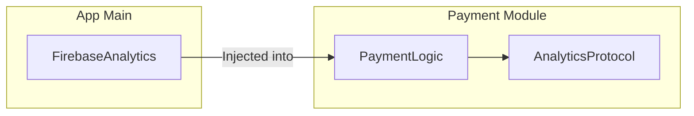

# Increased Modularity and Reusability

In modern iOS development, building a "Monolith" app is increasingly discouraged. Senior engineers strive for **Modularity**, where features are broken into separate **Swift Packages** or **Internal Frameworks**. Dependency Injection is the key that unlocks this modularity.

## 1. Feature Isolation
A module (e.g., `PaymentModule`) should not depend on your main application. Instead, it should define its needs as protocols. The main app then "injects" the concrete implementations.



## 2. True Reusability
A class that creates its own dependencies is hard to reuse. If you want to move a `ProfileView` from an iPhone app to a WatchOS app, but it's hard-coded to a complex iOS `CoreDataStack`, you are stuck.

**With DI**: You just inject a lighter `WatchOSStorage` implementation into the same `ProfileView`.

## 3. Library Independence
DI allows you to write business logic that doesn't care which third-party libraries you use.
-   **Example**: Your `SharingService` depends on a `SocialShareProtocol`. You can use a `FacebookLib` implementation in one app and a `TwitterLib` in another.

## 4. Compile-Time Performance
Modular codebases build faster. By using DI to decouple modules, you can build and test individual modules without compiling the entire massive application.

## Comparison: Monolith vs. Modular

| Aspect | Monolith (Tight Coupling) | Modular (Using DI) |
| :--- | :--- | :--- |
| **Component Reuse** | Very Hard | Easy |
| **Team Isolation** | Low (Conflicts likely) | High (Separate modules) |
| **Testing** | Large integration tests | Small, focused unit tests |
| **Build Times** | Slow | Fast (Incremental) |

## Example: A Reuseable Networking Module
By exporting only a protocol, the networking module remains "pure" and can be used in any project.

```swift
// In Networking Module
public protocol NetworkClient {
    func request(_ url: URL) -> Data
}

// In Application Feature
class MyFeature {
    let client: NetworkClient // No idea which library is used!
    init(client: NetworkClient) { ... }
}
```

## Summary
Modularity is the hallmark of a mature engineering organization. Dependency Injection provides the "socket" that allows different modules to plug into each other without knowing the internal details of how they work. This results in code that is more portable, easier to manage, and cheaper to maintain.
