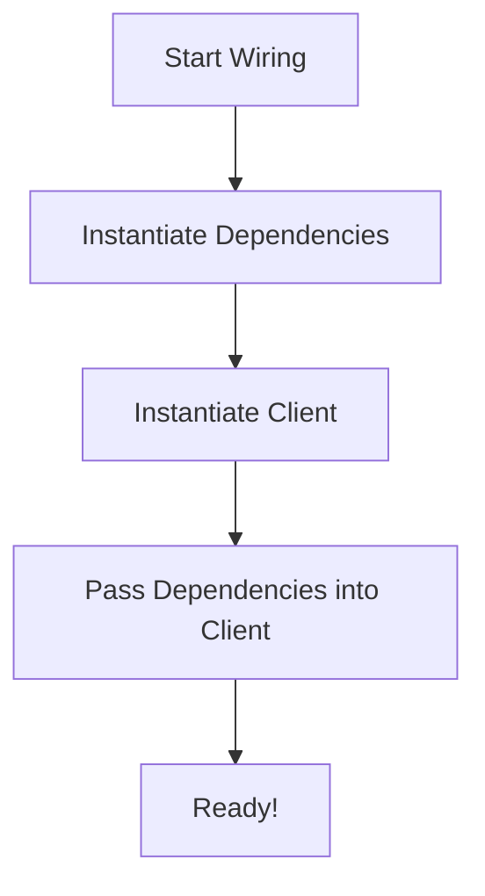

# The Injector (The component that passes the dependency)

The **Injector** (also called the **Assembler** or **Provider**) is the part of your system that handles the "wiring." Its sole purpose is to instantiate the dependencies and the client, and then connect them.

## The Active Role of the Injector
Unlike the Injectee (which is passive), the Injector is **active**. It has a high-level view of the entire application and knows:
1.  Which concrete classes to use for which protocols.
2.  How to configure those classes (API keys, endpoints).
3.  The lifecycle of each dependency (Singleton vs. Instance).

## Examples of Injectors in iOS

### 1. The Coordinator (Manual Injection)
In a Coordinator-based app, the coordinator often acts as the injector for the view controllers it creates.

```swift
class MainCoordinator {
    func start() {
        // The Coordinator is acting as the Injector
        let service = RealPaymentService(apiKey: "PROD_123")
        let viewModel = PaymentViewModel(service: service)
        let vc = PaymentViewController(viewModel: viewModel)
        navigationController.push(vc)
    }
}
```

### 2. The DI Container (Automated Injection)
Frameworks like Swinject act as a centralized, programmable Injector.

```swift
container.register(PaymentService.self) { _ in RealPaymentService() }
// Inside the resolution:
let vm = PaymentViewModel(service: container.resolve(PaymentService.self)!)
```

## The Single Responsibility of the Injector
A crucial rule for Senior Engineers: **The Injector should only inject.** It should not contain any business logic, network processing, or UI layout code. It is the "glue" of the application.

## High-Level Workflow of an Injector


## Comparisons: Where does the Injector live?

| Strategy | Location of Injector | Pros | Cons |
| :--- | :--- | :--- | :--- |
| **Manual** | In Coordinators / Factories | Full Control, No Magic | Boilerplate |
| **Centralized** | A single `DependencyRegistry` | Organized, Easy to find | Can become a "God Object" |
| **Container** | Third-party Framework | Very little code | Steep learning curve, runtime risk |

## Summary
The Injector is the architect that builds the house. By isolating all of your construction logic into dedicated Injector components (like Coordinators or Containers), you allow the rest of your app to focus purely on high-quality business logic and user experience.
