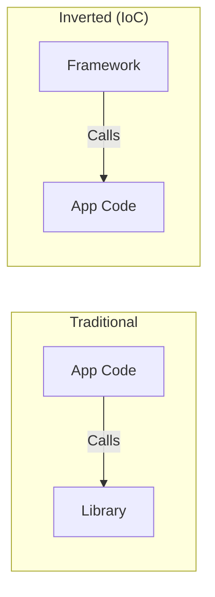

# Inversion of Control (IoC)

Inversion of Control (IoC) is a broad software engineering principle that describes a design where the flow of control is inverted compared to traditional procedural programming. While Dependency Injection is a *specific implementation* of IoC, the concept itself is much larger.

## The Mental Shift
Historically, your code would call a library (e.g., "Give me a string"). With IoC, a framework calls your code (e.g., "I will call you when a string is ready").

## Four Main Styles of IoC in iOS

### 1. Dependency Injection (The context of this guide)
Control over constructing dependencies is moved to an external injector.

### 2. Delegation Pattern (Typical Apple APIs)
A `UITableView` doesn't know how to render your data. It "inverts control" back to your `DataSource` to ask for a cell.
-   **Traditional**: You tell the UI what to do.
-   **IoC (Delegation)**: The UI asks YOU what it should display.

### 3. Closure / Callback Mechanisms
When you pass a closure to a `URLSession` data task, you are inverting control. You aren't "pulling" the data; you are giving the system a "callback" to execute when the data is ready.

### 4. SwiftUI View Lifecycle
SwiftUI's declarative nature is the ultimate IoC. You don't control the rendering or the state updates; the system manages the "Update Loop" and calls your `body` property when it decides it's necessary.

## Why Invert Control?
1.  **Removes Dependencies**: Your code doesn't need to know about the underlying framework's logic.
2.  **Extensibility**: You can change the behavior of a system (by providing a different delegate or dependency) without changing the system itself.
3.  **Efficiency**: The system can optimize things like view rendering or network task scheduling.

## Traditional Flow vs. Inverted Flow

## Comparison Matrix

| Aspect | Traditional | Inversion of Control |
| :--- | :--- | :--- |
| **Object Creation** | Manual `init()` | Injected by external entity |
| **Flow Management** | Your code owns the loop | Framework owns the loop |
| **Flexibility** | Rigid | Highly Extensible |
| **Testing** | Difficult | Trivial |

## Summary
Inversion of Control is the "Philosophy" of which Dependency Injection is the "Practice." By giving up control of instantiation and flow management to specialized components, you gain the freedom to write modular, testable, and highly flexible code.
