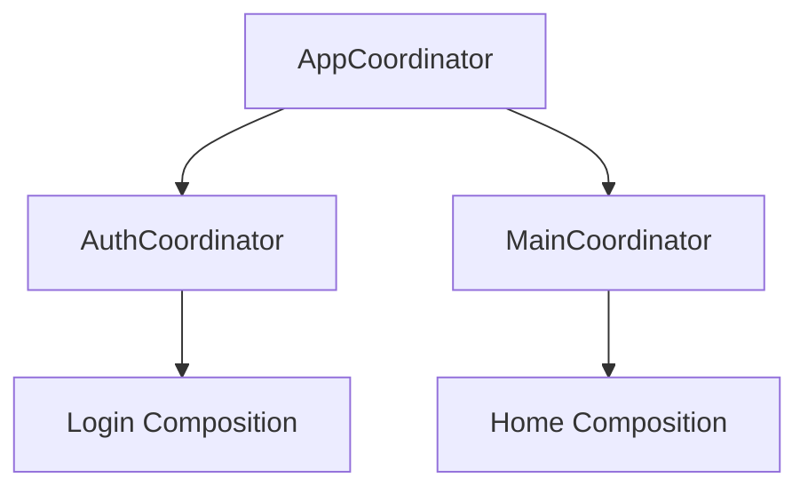

# Maintaining the Composition Root

As an application grows from a simple prototype into a complex production system, the **Composition Root** can become a massive, confusing mess of instantiation logic. Maintaining this file is a key architectural challenge for Senior iOS Engineers.

## The Problem: The "Everything" File
If you put every single service, view model, and coordinator instantiation into one giant `AppCoordinator` or `SceneDelegate`, you end up with a maintenance nightmare.

## Strategies for Maintenance

### 1. Partitioning by Feature / Flow
Instead of one massive root, use a hierarchy of **Coordinators**. Each coordinator acts as a "Local Composition Root" for a specific part of the app.



### 2. Dependency Factories
Move the creation logic into dedicated Factory objects. This keeps the coordinator focused on navigation while the factory handles the instantiation.

```swift
class SearchFactory {
    func makeSearch(api: API) -> UIViewController {
        let vm = SearchViewModel(api: api)
        return SearchViewController(vm: vm)
    }
}
```

### 3. Using Dependency Modules (Swinject style)
If using a DI Container, break your registrations into separate "Assemblies" or "Modules."

```swift
class NetworkingAssembly: Assembly {
    func assemble(container: Container) {
        container.register(API.self) { _ in RealAPI() }
    }
}

class SearchAssembly: Assembly {
    func assemble(container: Container) {
        container.register(SearchVM.self) { r in ... }
    }
}
```

## Composition Root Best Practices

1.  **Keep it Pure**: No business logic, no if-statements based on data, and no UI styling inside the root.
2.  **Singleton vs. Transient**: Clearly document which dependencies are long-lived and which are created every time.
3.  **Single Entry Point**: Ensure there is only ONE main root. If components are still `new`-ing each other, the root's purpose is defeated.

## Common Warning Signs
-   **Cyclic Dependencies**: If your root can't build because `A` needs `B` which needs `A`. (See [Circular Dependencies](circular-dependencies.md)).
-   **Deep Passing**: If you are passing 10 dependencies through 4 coordinators just to reach a single View. (Sign you need a **Container** or a **Context Object**).

## Summary
The Composition Root is the "map" of your application. Like any map, it must be kept clean, organized, and up-to-date. By partitioning your root using feature-based coordinators and factories, you can scale even the largest codebases while maintaining clear visibility into how everything is connected.
