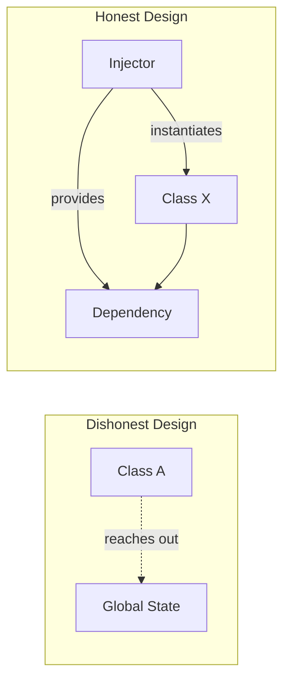

# Making Dependencies Explicit

The primary goal of Dependency Injection is to move from **Implied** dependencies (which are hidden) to **Explicit** dependencies (which are visible). This shift is fundamental to writing "honest," testable, and maintainable code.

## 1. Implied Dependencies (Hidden)
An implied dependency is one that a class assumes is available in the global scope. You cannot know it's there without reading the source code.

```swift
class OrderService {
    func placeOrder() {
        // HIDDEN: This class assumes URLSession.shared exists
        URLSession.shared.dataTask(...) 
        
        // HIDDEN: This class assumes Database.default is configured
        Database.default.save(...)
    }
}
```

## 2. Explicit Dependencies (Visible)
An explicit dependency is one that is declared as a requirement. You can see it immediately in the class definition or initializer.

```swift
class OrderService {
    let session: URLSession
    let database: DatabaseProtocol
    
    // VISIBLE: I cannot create an OrderService without these!
    init(session: URLSession, database: DatabaseProtocol) {
        self.session = session
        self.database = database
    }
}
```

## Why Explicit is Better

### 1. Self-Documentation
The initializer is a "contract." It tells any developer using the class exactly what is needed for it to function.

### 2. Predictable State
Because the dependencies are passed in, you have total control over the object's environment. You don't have to worry about a "Shared Instance" having the wrong state from a previous operation.

### 3. Ease of Refactoring
If you want to change the database requirement, you change the initializer. The compiler will then show you every place in your app that uses this service, allowing you to update them all at once.

### 4. Effortless Mocking
To test an explicit class, you just pass in mocks. You don't have to use "Swizzling" or mock global singleton states.

## Comparison Table

| Feature | Implied (Singleton/Global) | Explicit (DI) |
| :--- | :--- | :--- |
| **Visibility** | Hidden | Transparent |
| **Testing** | Hard (Side effects) | Easy (Isolated) |
| **Design** | Dishonest | Honest |
| **Coupling** | Tight | Loose |

## Moving Toward Explicit Design


## Summary
Explicit design is about **visibility**. By making every one of an object's requirements explicit in its interface, you reduce cognitive load, Eliminate hidden side-effects, and build a system that is robust against change.
