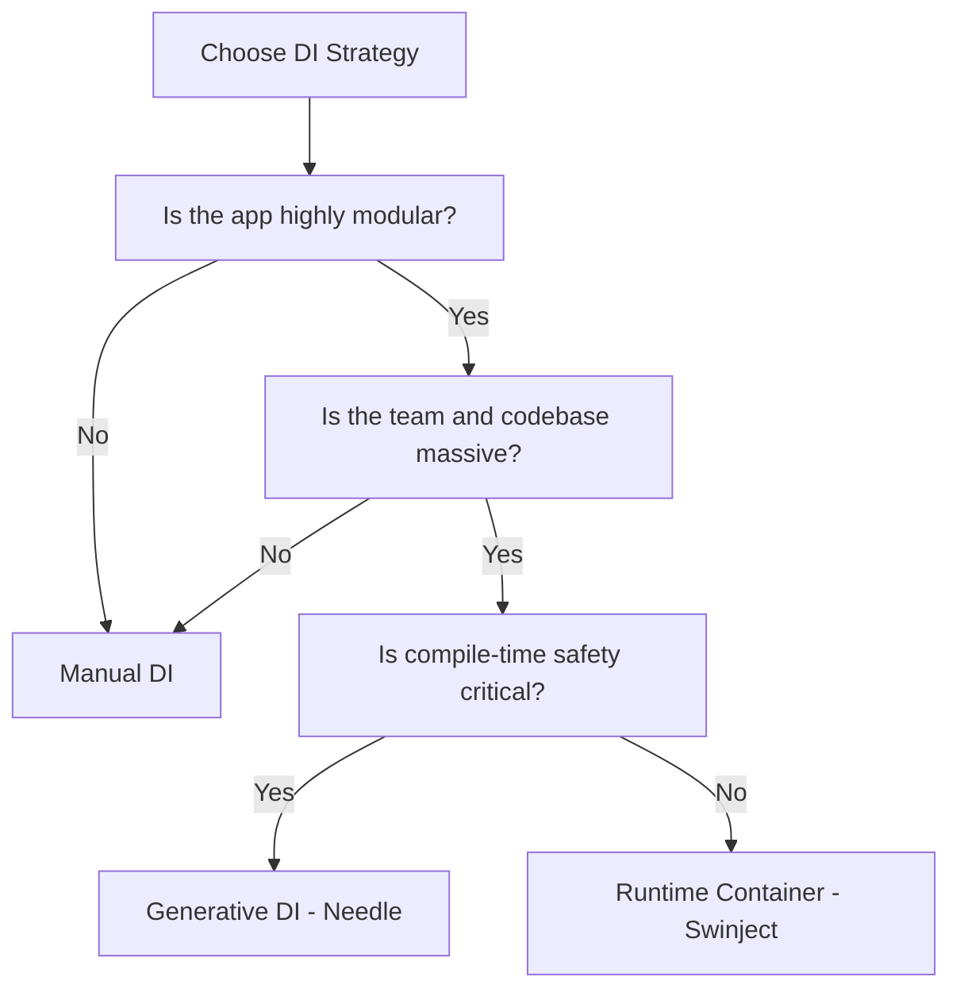

# Manual DI vs. Frameworks (Trade-offs)

One of the most debated topics among Senior iOS Engineers is whether to perform Dependency Injection **manually** or to use a **third-party framework** (like Swinject, Needle, or Factory). Both approaches have significant pros and cons.

## 1. Manual Dependency Injection
Manual DI involves passing dependencies through initializers and properties yourself, usually coordinated by **Coordinators** or **Factories**.

### Pros:
-   **Zero External Dependencies**: Your project remains "Pure Swift." No vendor lock-in.
-   **Absolute Safety**: The compiler catches every missing dependency. No runtime crashes.
-   **Transparency**: No "magic" resolution. You can trace every object's creation by Command-Clicking.

### Cons:
-   **Boilerplate**: You have to write out every initializer and pass every parameter manually.
-   **Initializer Bloat**: Large components can end up with 7+ parameters.
-   **Refactoring Friction**: Adding a new dependency to a low-level service might require updating many parent initializers.

## 2. Framework-Based DI (Containers)
Using a library to manage the lifecycle and resolution of components.

### Pros:
-   **Low Boilerplate**: One registration, and it's available everywhere.
-   **Scalability**: Easier to handle massive dependency graphs in huge modular projects.
-   **Advanced Scoping**: Handing things like "Graph Scopes" or "Session Scopes" is easier.

### Cons:
-   **Runtime Danger**: Swinject can crash at runtime if a registration is missing.
-   **Magic**: It's harder for a new developer to see "where did this instance come from?"
-   **Maintenance**: If the library stops being maintained or has a breaking update, it affects your whole app.

## Comparison Matrix

| Factor | Manual DI | Runtime Containers (Swinject) | Generative DI (Needle/Weaver) |
| :--- | :--- | :--- | :--- |
| **Type Safety** | 100% | Low | 100% |
| **Setup Cost** | Zero | Low | High |
| **Code Verbosity** | High | Low | Medium |
| **Performance** | Best | Slight Overhead | Good |
| **Runtime Crash Risk** | None | Possible | None |

## Recommendation Guidelines

1.  **Small to Medium App**: Stick with **Manual DI**. The safety and simplicity far outweigh the minor boilerplate.
2.  **Large Team / Modular App**: Consider **Manual DI with Coordinators**. If the boilerplate becomes painful, look into **Generative DI (Needle)** to get safety + convenience.
3.  **Experimental / Fast Prototype**: A Runtime Container like **Factory** or **Swinject** is fine for speed.

## Decision Flow Diagram

## Summary
The "Senior" choice is often to lean toward **Manual DI** initially. It forces good architectural hygiene and prevents the accumulation of technical debt associated with third-party libraries. Only reach for a framework when the manual approach truly starts to hinder development speed.
