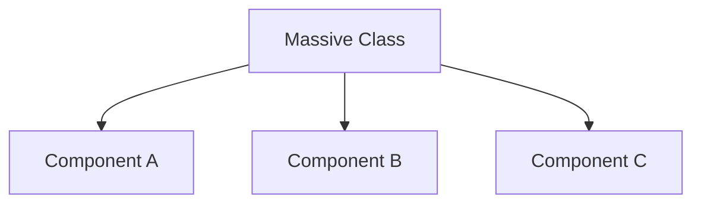

# Over-Injection (Too many dependencies)

**Over-Injection** occurs when a class requires an excessive number of dependencies. While it is a form of "honest" design (since it explicitly declares all requirements), a high dependency count is usually a red flag for poor architecture.

## How many is "Too Many"?
While there is no hard rule, many architects consider **5 or more dependencies** in a single class to be a warning sign of **Over-Injection**.

## Why Over-Injection is Dangerous

### 1. Violation of SRP (Single Responsibility Principle)
If a ViewModel needs a Networking Service, a Database Service, an Analytics Service, a Bluetooth Service, and a Push Notification Service, it is likely trying to manage the entire application rather than a specific screen.

### 2. High Cognitive Load
Developers reading the code have to understand the interactions between all 6+ dependencies, making the logic much harder to follow.

### 3. Testing Hell
Setting up a unit test for a class with 10 dependencies requires creating 10 mocks. This makes writing tests so painful that developers often stop doing it.

## How to Fix Over-Injection

### 1. The Facade Pattern
Combine several related group of services into a single, higher-level interface.
-   **Before**: `init(auth: Auth, profile: Profile, settings: Settings)`
-   **After**: `init(userService: UserService)` where `UserService` handles all three.

### 2. Decompose the Class
Break the class into smaller, more specialized components.


### 3. Use Configuration Objects
If the dependencies are static configurations, group them into a single struct.
```swift
struct FeatureConfig {
    let color: UIColor
    let timeout: TimeInterval
    let isEnabled: Bool
}
```

## Dependency Count Checklist

| Count | Assessment | Action |
| :--- | :--- | :--- |
| **1-3** | Healthy | No action needed. |
| **4-5** | Borderline | Check for SRP violations. |
| **6+** | Critically Over-Injected | IMMEDIATE Refactor required. |

## Pro-Tip: Interface Segregation (ISP)
Sometimes, over-injection happens because you are passing a large protocol when the class only needs one small method. Break giant protocols into smaller "traits" to keep the surface area small.

# Summary
Over-injection is like a smoke alarm; it tells you that the "fire" of complexity is burning in your class. When you see your initializers growing too long, don't look for a way to hide the parameters—look for a way to simplify the responsibilities of the class.
