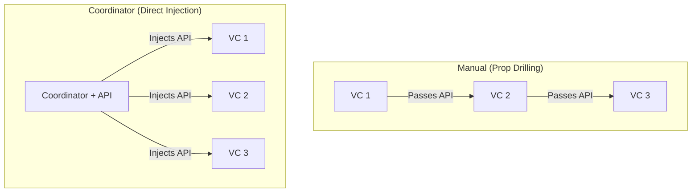

# Passing Dependencies through the Navigation Stack

In iOS development, a common challenge is passing dependencies deep into a navigation hierarchy (e.g., from `TabA` -> `List` -> `Detail` -> `Edit`). Doing this manually through every level is often called **"Prop Drilling"** or **"Dependency Tunneling."**

## 1. Manual Passing (The Direct Way)
Each View Controller in the chain becomes an "Injector" for the next one.

```swift
class ListVC: UIViewController {
    let api: API // Passed from Home
    
    func showDetail() {
        let detailVC = DetailVC(api: self.api) // Passing it forward
        navigationController?.push(detailVC)
    }
}
```
### Pros:
- Explicit and easy to trace.
### Cons:
- Intermediate layers (like `ListVC`) are forced to hold dependencies they don't even use.

## 2. Using the Coordinator Pattern (The Senior Way)
Coordinators separate navigation logic from view logic. The Coordinator holds the dependencies and injects them into the view controllers as they are created.

```swift
class ProductCoordinator: Coordinator {
    let api: API
    
    func showDetail(for product: Product) {
        // Coordinator acts as the central provider
        let detailVM = DetailVM(api: api, product: product)
        let detailVC = DetailVC(viewModel: detailVM)
        navigationController.push(detailVC)
    }
}
```
### Why it's better:
-   **Decoupling**: `ListVC` no longer has to know about the requirements of `DetailVC`.
-   **Cleanliness**: View controllers only hold what they actually need.

## 3. The SwiftUI Way (@Environment)
SwiftUI solves this using the "Environment" system, which allows you to "teleport" dependencies across the view tree.

```swift
struct RootView: View {
    let api = RealAPI()
    var body: some View {
        ListView()
            .environmentObject(api) // Inject here
    }
}

// Deep nested view
struct EditView: View {
    @EnvironmentObject var api: RealAPI // Retrieve here
}
```

## Comparison of Propagation Strategies

| strategy | Recommended for | Complexity |
| :--- | :--- | :--- |
| **Manual** | Small, shallow trees | Low |
| **Coordinator** | Complex apps / UIKit | Medium |
| **DI Container** | Massive modular apps | High |
| **Environment** | SwiftUI apps | Low |

## Visualization: Coordinator vs. Manual


## Summary
Passing dependencies should be handled by an orchestrator, not by the views themselves. Using the **Coordinator Pattern** in UIKit or the **Environment** system in SwiftUI ensures that your navigation stack remains clean and that your view components stay decoupled from each other's requirements.
