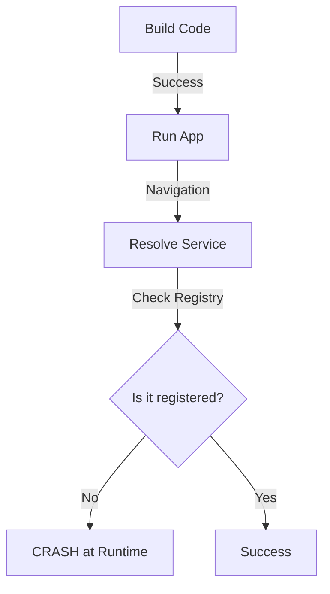

# Runtime Resolution & Hidden Dependencies

**Runtime Resolution** refers to a style of Dependency Injection where objects are looked up dynamically when the app is running, usually via a **DI Container**. This approach has significant trade-offs regarding safety and transparency.

## 1. The Pro: Extreme Flexibility
In a runtime-resolved system, you can change the entire behavior of your app at startup (or even later) just by changing a registration in a container.

-   **Example**: Switching from `MockStore` to `ProductionStore` based on a backend flag received at launch.

## 2. The Con: The "Hidden Dependency" Problem
When you use a container, a class often looks like it has no dependencies because its initializer is empty.

```swift
class HiddenVM {
    // Hidden: This resolution happens inside the variable
    let api = container.resolve(API.self)! 
    
    init() {} // Dishonest: appears to have no requirements
}
```

### Why this is Dangerous:
1.  **Unit Test Friction**: To test `HiddenVM`, you have to know it needs an `API`, find where it resolves it, and configure a mock container.
2.  **Opaque Requirements**: A new developer can't understand the system graph without diving deep into every implementation file.

## 3. The Risk of Runtime Crashes
In manual DI, if you forget a parameter, your code won't build. In runtime DI, it builds fine but crashes the moment the problematic screen is opened.



## Comparison: Runtime vs. Manual

| Feature | Manual (Compile-time) | Container (Runtime) |
| :--- | :--- | :--- |
| **Safety** | Absolute | Risky |
| **Transparency** | Clear `init` | Hidden resolutions |
| **Refactoring** | Compiler-assisted | Manual search-and-replace |
| **Boilerplate** | High | Low |

## Best Practices for Runtime DI

If you must use a runtime container:
1.  **Prefer Property Wrappers**: Use `@Injected` instead of manual `container.resolve()` calls for consistency.
2.  **Verify at Launch**: Write a small script or test that iterates through the whole container at app launch to ensure every protocol has a registration.
3.  **Limited Scope**: Don't use the container everywhere. Use it to provide services to your **Coordinators**, then use **Manual Injection** from the coordinator to the ViewModels.

## Summary
Runtime resolution is a double-edged sword. It offers great convenience and reduced boilerplate but introduces "hidden" requirements and a risk of production crashes. For a Senior Engineer, the goal is to balance these trade-offs, often using a "Hybrid" approach where the container lives only at the highest level of the architecture.
