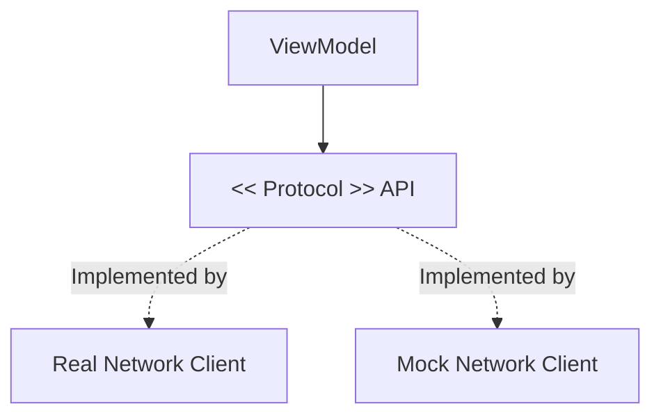

# Protocols as Dependencies

The core of effective Dependency Injection is the use of **Protocols** (Abstractions) instead of concrete classes. This adheres to the **Dependency Inversion Principle**, which states that high-level modules should not depend on low-level modules; both should depend on abstractions.

## 1. Defining the Contract
A protocol defines a set of behaviors without specifying *how* those behaviors are achieved.

```swift
protocol StorageProvider {
    func save(_ data: Data, key: String)
    func fetch(key: String) -> Data?
}
```

## 2. Depending on the Abstraction
The consumer of the dependency should only ever see the protocol.

```swift
class ProfileViewModel {
    // We depend on the BEHAVIOR of storage, not its implementation.
    let storage: StorageProvider 
    
    init(storage: StorageProvider) {
        self.storage = storage
    }
}
```

## 3. The Power of Swappability
Because `ProfileViewModel` only knows about `StorageProvider`, it doesn't care which class is behind it.

-   **Production**: `CoreDataStorage` implements `StorageProvider`.
-   **Testing**: `MockStorage` implements `StorageProvider`.
-   **New Feature**: `CloudStorage` implements `StorageProvider`.

## Why this is critical for Senior Engineers:

1.  **Unit Testing**: You can't mock a concrete class easily (especially final classes). You can always mock a protocol.
2.  **API Resilience**: If a third-party library changes its API, you only update your concrete "Adapter" class. The rest of your app remains untouched.
3.  **Cross-Platform code**: You can share a ViewModel between iOS and macOS, injecting a `AppKitImageSaver` on Mac and a `UIKitImageSaver` on iOS, both following the same protocol.

## Protocols vs. Concrete types in DI

| Factor | Concrete Class | Protocol |
| :--- | :--- | :--- |
| **Coupling** | Tight | Loose |
| **Testing** | Hard (requires real instance) | Easy (requires Mock) |
| **Mocking** | Requires inheritance | requires conformance |
| **Flexibility** | Low | High |

## Visualizing Abstract Dependencies


## Summary
Never inject a concrete class when a protocol will do. By programming to protocols, you create "boundaries" in your application that protect your business logic from the volatility of external frameworks and implementation details.
