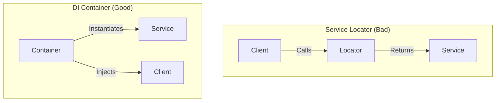

# Service Locators vs. DI Containers

It is common to confuse a **Service Locator** with a **Dependency Injection Container**, as they both act as a registry for services. However, the way they are used—and their impact on software architecture—is fundamentally different.

## 1. The Core Difference: Who is in Control?

### Service Locator (The "Pull" Model)
A class asks the locator for its own dependencies. The class is performing an active search.
-   **Class logic**: `let api = locator.resolve(API.self)`
-   **Dependency is**: Hidden.

### DI Container (The "Push" Model)
A class defines what it needs in its constructor, and the container (managed by the Injector) "pushes" those requirements in at instantiation time.
-   **Class logic**: `init(api: API)`
-   **Dependency is**: Explicit.

## 2. Comparison Table

| Feature | Service Locator | DI Container |
| :--- | :--- | :--- |
| **Visibility** | Hidden within the code | Explicit in the signature |
| **Testing** | Hard (Requires global state setup) | Easy (Inject mocks directly) |
| **Control** | Component controls its lookup | Inversion of Control (External) |
| **Coupling** | High (Every class depends on Locator) | Low (Classes depending on Protocols) |
| **Maintenance** | Opaque dependencies | Transparent requirements |

## 3. When to use which?

### DI Containers (Preferred)
In almost all modern iOS architecture (MVVM, VIPER, Clean Architecture), a DI Container used at the **Composition Root** is the professional choice. It allows for a clean separation of configuration and business logic.

### Service Locators (Last Resort)
Service locators can be useful in huge, legacy Objective-C apps where refactoring every initializer is physically impossible. They provide a quicker, but dirtier, way to decouple services.

## Visualizing the Interaction

## Summary
The goal of architecture is to make dependencies visible and manageable. While both tools use a central registry, the use of a **DI Container** (via Constructor Injection) promotes a more "honest" and testable design than the Service Locator pattern.
