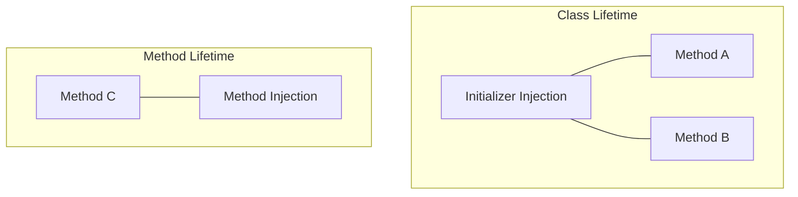

# When to use Method-Specific Dependencies

While most dependencies are best handled via initializers, **Method Injection** is a specialized tool that should be used when a dependency is only relevant for a short time or for a specific operation.

## 1. Ephemeral Dependencies
Use method injection for objects that change frequently or are only needed for a single task.

### Example: The Validator
A `FormViewModel` might need different validators for different fields. Passing the validator to the `validate` method is cleaner than storing 10 validators as properties.

```swift
class FormViewModel {
    func validate(input: String, using validator: Validator) {
        if validator.isValid(input) { ... }
    }
}
```

## 2. Stateless Context Objects
Passing a "Context" (like a database connection or a user session) to a method can make your code more functional and easier to reason about.

```swift
class ReportGenerator {
    // We don't store the db, we just use it when asked
    func generate(using db: DatabaseConnection) {
        let data = db.fetch()
        // ...
    }
}
```

## 3. High-Frequency Value Changes
If a dependency depends on the *current time* or the *current user location*, it is often better to inject it at the method level to avoid stale data.

```swift
func syncData(at location: CLLocation) { ... }
```

## When NOT to use it
-   **Core Services**: If every method in your class needs the `NetworkService`, inject it in the `init` instead.
-   **Deep Passing (Tunneling)**: If you find yourself passing the same parameter through 4 levels of methods, it should probably be a stored dependency.

## Decision Table

| Scenario | Recommendation | Why? |
| :--- | :--- | :--- |
| **API Client** | Initializer | Used by nearly every method. |
| **Database Save** | Method | Specific to one action. |
| **Current User** | Method | User can log out/change unexpectedly. |
| **Coordinator Factory** | Initializer | Responsible for navigation lifetime. |

## Visualizing Method vs. Initializer Scope


## Summary
Method injection is a powerful technique for keeping your classes stateless and your scopes small. As a Senior Engineer, you should use it to reduce the amount of persistent state in your objects, moving toward a more functional and predictable architecture.
