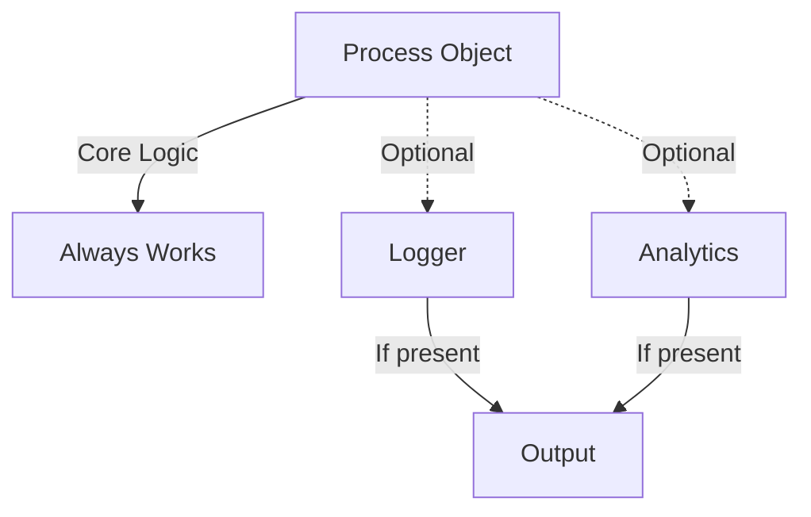

# Optional Dependencies and Mutable Objects

While mandatory dependencies are the standard, **Optional Dependencies** (often handled via **Property Injection**) have a specific place in iOS architecture, particularly for cross-cutting concerns and UI-driven code.

## 1. When to use Optional Dependencies
A dependency is optional if the class **can function perfectly well without it**, or if it has a sensible "Null Object" fallback.

### Examples:
-   **Analytics Tracker**: Your app's logic should work even if you aren't tracking data.
-   **Logging**: The service should run regardless of whether a logger is attached.
-   **Delegates**: A `UITableView` doesn't *require* a delegate to exist (though it's not very useful without one).

## 2. Using Choice (Mutable Objects)
Since optional dependencies are handled via Property Injection, they are by definition **mutable**.

### The Good Side:
-   **Swappability at Runtime**: You can attach a `DebugLogger` when the user enters a special mode and detach it later.
-   **Lifecycle flexibility**: You can inject the dependency after the object has been initialized (e.g., in `viewDidLoad`).

### The Risk Side:
-   **Nil Checks**: You must safely unwrap the dependency or use a default.
-   **Side Effects**: Changing a dependency while an object is mid-task can lead to unpredictable results.

```swift
class DataProcessor {
    // Optional dependency
    var logger: LoggerProtocol?
    
    func process() {
        // Safe usage
        logger?.log("Processing started")
        // ... business logic ...
    }
}
```

## 3. Best Practices for Optionals
1.  **Avoid Force-Unwrapping**: Use `?` (Optional Chaining) or Provide a "No-op" default implementation.
2.  **Use `private(set)`**: Prevent other objects from unexpectedly changing the dependency.
3.  **Late Injection**: Only use this pattern for classes you don't control, like `UIViewController`.

## Comparison Matrix

| Property | Mandatory (`let`) | Optional (`var?`) |
| :--- | :--- | :--- |
| **Philosophy** | "I cannot work without this" | "I can use this if available" |
| **Logic Type** | Core Business Logic | Cross-cutting (Logging, Analytics) |
| **Safety** | High (Compile-time) | Medium (Nil checks required) |
| **Mutability** | Final (Constant) | Changeable (Setter) |

## Visualizing Optional Injection


## Summary
Optional dependencies are the "icing on the cake" of your architecture. Use them for supplemental features that aren't critical to the core logic of the class. This keeps your main dependencies clean while still allowing for a highly flexible and feature-rich application.
