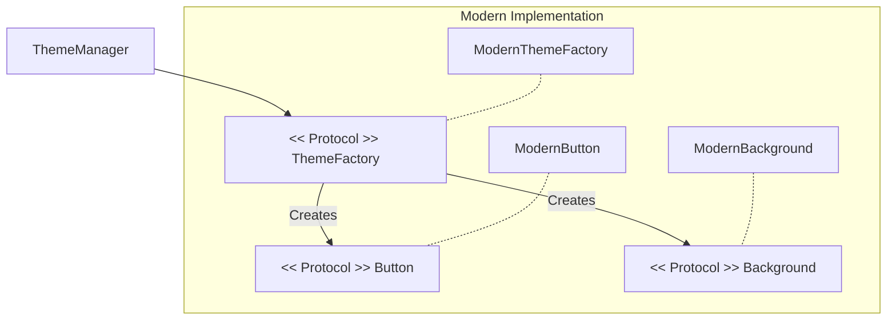

# Abstract Factory (Family of Related Objects)

The **Abstract Factory** is a creational design pattern that provide an interface for creating families of related or dependent objects without specifying their concrete classes.

## 1. When to use it
In iOS development, use an Abstract Factory when your app needs to support multiple "themes" or "environments" where the UI components or services must remain consistent with each other.

### Example: UI Theme Factory
Imagine an app that supports both a "Modern" and a "Retro" look.

```swift
protocol Button { func render() }
protocol Background { func display() }

protocol ThemeFactory {
    func makeButton() -> Button
    func makeBackground() -> Background
}

// Concrete Factory 1: Modern
class ModernThemeFactory: ThemeFactory {
    func makeButton() -> Button { return ModernButton() }
    func makeBackground() -> Background { return ModernBackground() }
}

// Concrete Factory 2: Retro
class RetroThemeFactory: ThemeFactory {
    func makeButton() -> Button { return RetroButton() }
    func makeBackground() -> Background { return RetroBackground() }
}
```

## 2. Key Benefits
1.  **Guarantee of Compatibility**: All objects created by a single factory are guaranteed to work together. You won't accidentally mix a Retro Button with a Modern Background.
2.  **Decoupling**: The client code only interacts with the `ThemeFactory` protocol, making it easy to add new themes later.
3.  **Single Responsibility**: The creation logic is isolated in the factory, keeping the ViewController clean.

## 3. Difference from Factory Method
-   **Factory Method**: Creates **one** product.
-   **Abstract Factory**: Creates a **family** of related products.

## Comparison Table

| Aspect | Factory Method | Abstract Factory |
| :--- | :--- | :--- |
| **Focus** | One object | Multiple related objects |
| **Complexity** | Low | High |
| **Pattern Level** | Method level | Class/Object level |

## Visualizing the Pattern


## Summary
The Abstract Factory is a powerful tool for maintaining consistency across a large set of related objects. By abstracting the creation of "families" of products, you ensure that your code remains scaleable, themeable, and highly organized.
