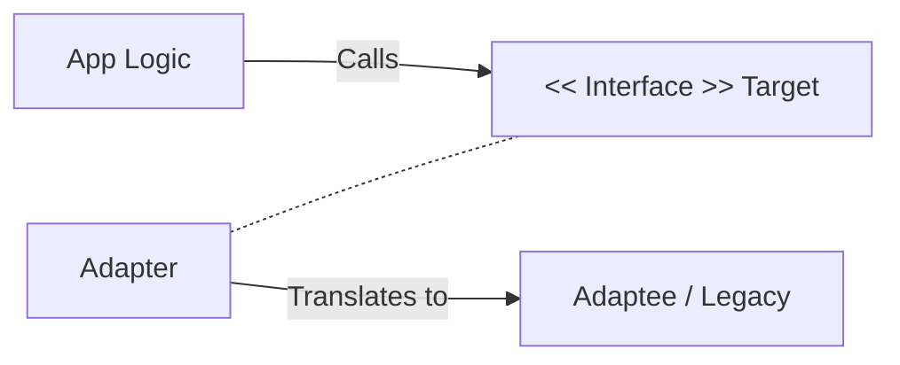

# Adapter Pattern

The **Adapter Pattern** is a structural design pattern that allows objects with incompatible interfaces to work together. In the iOS world, it is most commonly used to wrap third-party libraries or legacy APIs to match your application's current protocols.

## 1. The Core Concept
The Adapter acts as a "translator." It implements the interface your app expects (the **Target**) and maps those calls to an existing class (the **Adaptee**).

### Example: Adapting a Third-Party Networking Library
Your app expects a protocol called `DataFetcher`. You want to use a library called `LegacyAPI` which uses different method names.

```swift
// Target (What your app expects)
protocol DataFetcher {
    func fetch() -> String
}

// Adaptee (The existing library)
class LegacyAPI {
    func getRemoteData() -> String { return "Data" }
}

// Adapter (The Bridge)
class APIAdapter: DataFetcher {
    private let legacy: LegacyAPI
    
    init(legacy: LegacyAPI) {
        self.legacy = legacy
    }
    
    func fetch() -> String {
        return legacy.getRemoteData() // Translating the call
    }
}
```

## 2. Implementing in Swift (Extensions)
One of the most powerful ways to implement an Adapter in Swift is using **Extensions**.

```swift
extension LegacyAPI: DataFetcher {
    func fetch() -> String {
        return self.getRemoteData()
    }
}
```

## 3. When to use it
1.  **Library Wrappers**: Protecting your core logic from breaking changes in external dependencies.
2.  **Legacy Code**: Making old Objective-C classes work with new Swift protocols.
3.  **Cross-Platform UI**: Adapting `NSView` (macOS) to behave like `UIView` (iOS) in a shared logic layer.

## Comparison Table

| Feature | Delegate Pattern | Adapter Pattern |
| :--- | :--- | :--- |
| **Purpose** | Communication | Compatibility |
| **Logic** | Asks for help | Translates a call |
| **Interface** | Defines a new one | Matches an existing one |

## Visualizing the Adapter


## Summary
The Adapter Pattern is your "firewall" against the outside world. By using adapters to wrap external systems, you ensure that your application's core logic remains pure and independent of specific implementation details from third-party vendors.
