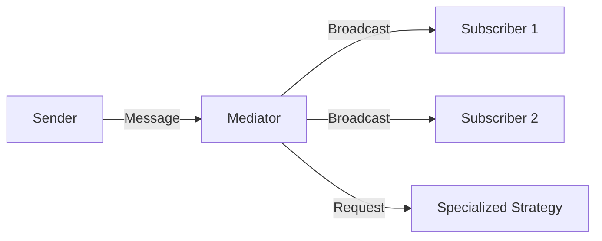

# Behavioral Design Patterns

**Behavioral Design Patterns** are concerned with algorithms and the assignment of responsibilities between objects. They describe not just patterns of objects or classes, but the patterns of communication between them.

## 1. Core Focus
While Creational patterns focus on *how* objects are made, and Structural patterns focus on *how* they are organized, Behavioral patterns focus on **how they talk to each other**.

## 2. Key Behavioral Patterns in iOS

| Pattern | Common iOS Analogy | Primary Goal |
| :--- | :--- | :--- |
| **Observer** | NotificationCenter / Combine | Notifying changes to many objects. |
| **Delegate** | UITableViewDelegate | Handing off a specific task to another object. |
| **Command** | Undo Manager | Encapsulating a request as an object. |
| **Strategy** | Sorting Algorithms | Making algorithms interchangeable. |
| **State** | View States (Loading, Error, Success) | Altering behavior based on internal state. |
| **Memento** | Codable / UserState saving | Restoring an object to a previous state. |

## 3. Why use them?
Behavioral patterns reduce the complexity of control flow in your app. Instead of writing massive `switch` statements or deep nested `if` blocks, you delegate the logic to specialized objects.

## Visualizing Behavioral Communication

## 4. Best Practices for Behavioral Design
-   **Prefer Composition**: Don't use massive inheritance chains to change behavior. Use a Strategy or a State object instead.
-   **Avoid Tight Coupling**: Use protocols to ensure that the sender of a message doesn't need to know exactly who the receiver is (e.g., Use Delegation).
-   **Keep it Simple**: If a simple closure can handle the communication, don't build a complex Command or Mediator.

## Summary
Behavioral patterns are the "social rules" of your application. They ensure that communication between your objects is orderly, efficient, and decoupled, allowing your software to scale without turning into "spaghetti code."
