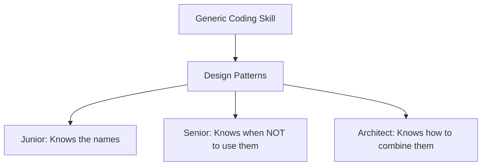

# Benefits of Using Design Patterns

Design patterns are documented, reusable solutions to common software engineering problems. For a Senior iOS Engineer, they are not just "theoretical concepts" but essential tools for building production-grade software.

## 1. Improved Readability (The Shared Language)
When you tell a colleague, "I used a Coordinator for navigation and a Factory for the ViewModels," they immediately understand the structure of the code without looking at a single line of Swift.
-   **Patterns provide a standard vocabulary** that speeds up code reviews and onboarding.

## 2. Enhanced Flexibility
Patterns like **Strategy** and **Adapter** make it easy to swap implementations as project requirements change.
-   **Example**: Switching from an on-device database to a cloud-based database is trivial if you followed a **DAO (Data Access Object)** or **Repository** pattern.

## 3. Long-term Maintainability
By following patterns that enforce **Separation of Concerns** (like MVVM or VIPER), you prevent individual files from becoming "Massive View Controllers."
-   Smaller, focused classes are easier to bug-fix and safer to refactor.

## 4. Faster Development
Once a team agrees on a pattern, the "how" of development is already solved. This allows the team to focus 100% on the **User Experience** and the **Business Logic**.

## Benefit Summary Table

| Benefit | Impact on Developer | Impact on Business |
| :--- | :--- | :--- |
| **Readability** | Faster code reviews | Lower talent onboarding costs |
| **Flexibility** | Ability to pivot features | Faster time-to-market for changes |
| **Maintenance** | Fewer regressions | Lower cost of long-term ownership |
| **Efficiency** | Reusable templates | Predictable project timelines |

## The Industry Perspective

## Summary
Design patterns are the "distilled experience" of thousands of engineers who came before you. By using them, you avoid "reinventing the wheel" and ensure that your code is built on a foundation of proven, scalable, and professional-grade practices.
