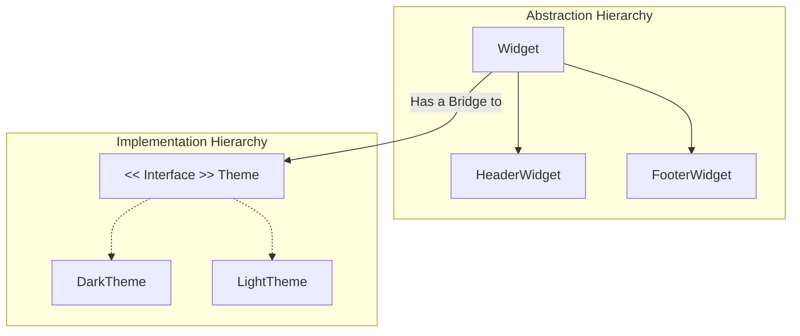

# Bridge Pattern

The **Bridge Pattern** is a structural design pattern that lets you split a large class or a set of closely related classes into two separate hierarchies—**abstraction** and **implementation**—which can be developed independently of each other.

## 1. The Core Concept
The Bridge pattern is effectively "Composition over Inheritance." Instead of having a massive matrix of subclasses (e.g., `BlueButton`, `RedButton`, `BlueIcon`, `RedIcon`), you have a `Shape` abstraction that holds a reference to a `Color` implementation.

### Example: UI Theming
```swift
// Implementation Hierarchy
protocol Theme {
    func backgroundColor() -> UIColor
    func textColor() -> UIColor
}

class DarkTheme: Theme { ... }
class LightTheme: Theme { ... }

// Abstraction Hierarchy
class BaseWidget {
    let theme: Theme // This is the "Bridge"
    init(theme: Theme) { self.theme = theme }
}

class HeaderWidget: BaseWidget { 
    func render() {
        self.view.backgroundColor = theme.backgroundColor()
    }
}
```

## 2. When to use it
In iOS, use the Bridge pattern when:
1.  **Cross-Platform Consistency**: Sharing generic logic between `UIKit` and `AppKit`.
2.  **Complex Theming**: Decoupling the "What it is" (Button, Label) from the "How it looks" (Primary, Secondary, Error).
3.  **Persistence Layer**: Decoupling high-level `DataStore` logic from low-level `StorageDriver` (Realm, CoreData, UserDefaults).

## 3. Comparison with Adapter
-   **Adapter**: Makes incompatible things work together **after they are built**.
-   **Bridge**: Connects different hierarchies **during the design phase** so they can grow independently.

## Visualizing the Bridge


## Summary
The Bridge Pattern prevents "Exploding Class Hierarchies." By separating the dimensions of change (e.g., UI Type and UI Style) into different objects, you make your code significantly easier to extend and maintain without creating hundreds of subclasses.
