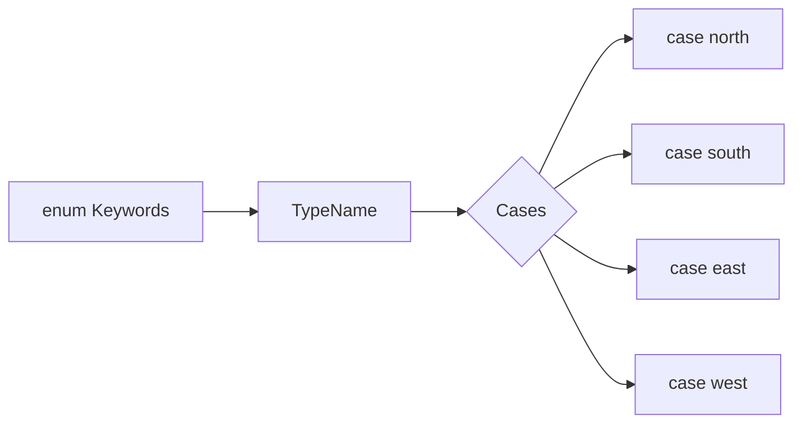

# Defining Enums (`enum CompassPoint { ... }`)

Enumerations (enums) define a common type for a group of related values and enable you to work with those values in a type-safe way within your code.

## 1. Basic Definition
The simplest way to define an enum is by using the `enum` keyword followed by the cases.

```swift
enum CompassPoint {
    case north
    case south
    case east
    case west
}
```

Unlike C or Objective-C, Swift enumeration cases are not assigned a default integer value when they are created. In the `CompassPoint` example above, `north`, `south`, `east`, and `west` are full-fledged values in their own right.

## 2. Multiple Cases on One Line
You can also define multiple cases on a single line, separated by commas:

```swift
enum Planet {
    case mercury, venus, earth, mars, jupiter, saturn, uranus, neptune
}
```

## 3. Type Inference
Once an enum is declared, you can use dot syntax to assign its cases to variables. Swift uses type inference to determine the enum type.

```swift
var directionToHead = CompassPoint.west

// Since the type is already known, you can use the shorthand .case
directionToHead = .north
```

## 4. Matching with Switch
A `switch` statement must be exhaustive when considering enum cases.

```swift
switch directionToHead {
case .north:
    print("Lots of planets have a north")
case .south:
    print("Watch out for penguins")
case .east:
    print("Where the sun rises")
case .west:
    print("Where the skies are blue")
}
```

## Diagram: Enum Anatomy


> [!NOTE]
> Swift enums are **Value Types**, meaning they are passed by value, not by reference.
