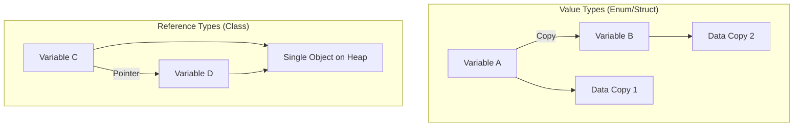

# Enums as Value Types

In Swift, Enumerations are **Value Types**, just like Structs. This has significant implications for how they are stored, copied, and used in multi-threaded environments.

## 1. Copy Behavior
When you assign an enum to a new variable or pass it to a function, a full copy of the value is created.

```swift
enum Settings {
    case darkTheme
    case lightTheme
}

var userSettings = Settings.darkTheme
var systemSettings = userSettings // A copy is made

systemSettings = .lightTheme
print(userSettings) // still .darkTheme
```

## 2. Stack Allocation
Because enums are value types, they are typically allocated on the **Stack** rather than the Heap (recursive enums are an exception). This makes them very efficient to create and destroy.

## 3. Thread Safety
Since each thread gets its own copy of an enum value when passed around, there is no risk of one thread modifying a shared instance and causing a race condition. This inherent "immutability by default" is a core pillar of Swift's safety.

## 4. Mutating Methods
If you want to change the value of `self` within an enum method, you must mark it as `mutating`.

```swift
enum PlayerState {
    case idle, running, jumping

    mutating func jump() {
        if self == .running {
            self = .jumping
        }
    }
}
```

## Comparison: Value vs. Reference


> [!TIP]
> Prefer Enums and Structs over Classes whenever you don't need identity or shared state. They are faster and safer.
