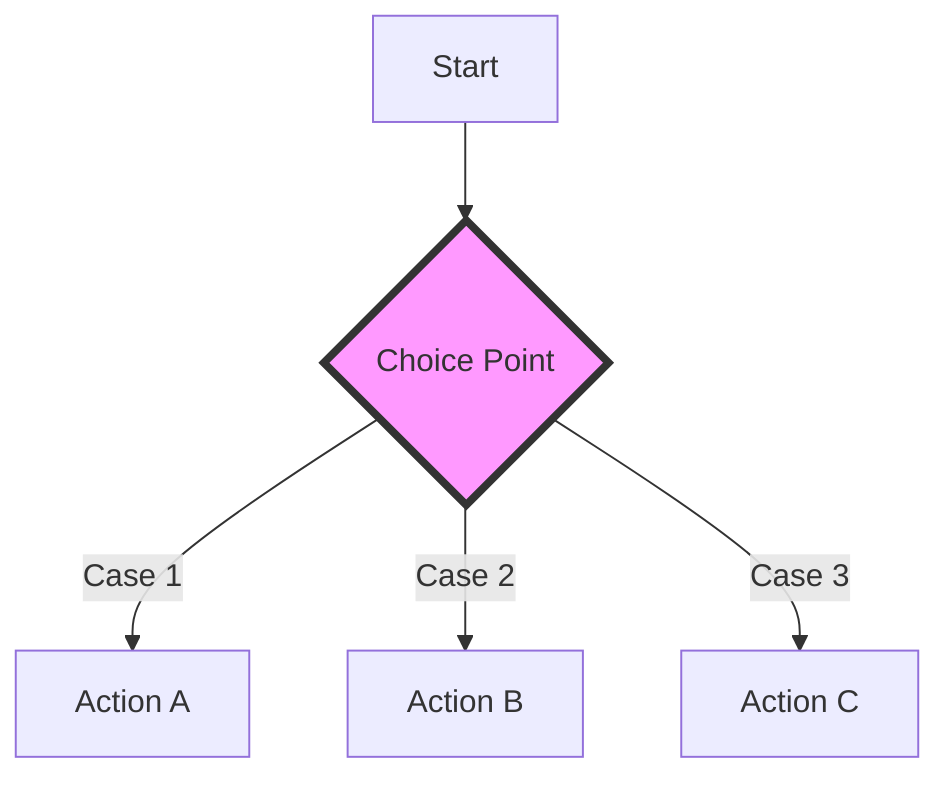

# Introduction to Enumerations

An **Enumeration** (or "enum") defines a common type for a group of related values. Enums in Swift are much more powerful than in many other languages, acting as first-class types that can have methods, properties, and complex internal data.

## 1. What is an Enum?
At its core, an enum allows you to represent a choice from a closed set of possibilities.

```swift
enum Season {
    case spring
    case summer
    case autumn
    case winter
}
```

## 2. Why Use Enums?
- **Type Safety**: Prevents passing invalid strings or integers where a specific set of choices is expected.
- **Exhaustiveness**: The compiler forces you to handle every case in a switch statement.
- **Code Clarity**: `Season.summer` is much more readable than `1` or `"Summer"`.
- **Logic Encapsulation**: You can bundle behavior (methods) directly with the related data.

## 3. Enum Evolution in Swift
In Swift, enums have evolved to include:
- **Associated Values**: Storing unique data per instance.
- **Raw Values**: Mapping cases to fixed primitive types.
- **Protocols**: Conforming to interfaces like `Codable` or `Hashable`.

## 4. Basic Syntax
```swift
var currentSeason = Season.spring
currentSeason = .summer // Shorthand syntax when type is known
```

## Logic Flow Diagram


> [!TIP]
> Use enums whenever you have a finite set of states (e.g., `Loading`, `Success`, `Error`) or a fixed list of options (e.g., `Small`, `Medium`, `Large`).
