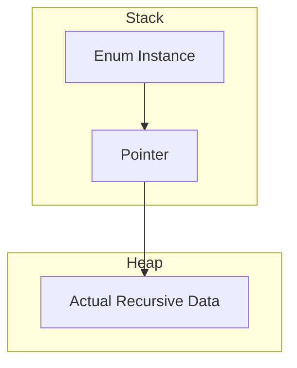

# Using `indirect` Keyword

The `indirect` keyword is a specialized modifier used with enums to enable **Recursive Data Structures**. It instructs the Swift compiler to use a layer of indirection when storing associated values.

## 1. Memory Management Under the Hood
Swift enums are value types. To keep them efficient, the compiler tries to determine their size at compile time. However, a recursive enum (one that contains itself) has an "infinite" theoretical size.

By using `indirect`, the associated value is stored as a **Reference** (pointer) on the Heap, while the enum itself remains a value type on the Stack.

## 2. Per-Case Indirection
You can apply `indirect` to specific cases that need it.

```swift
enum FileSystemItem {
    case file(name: String)
    indirect case folder(name: String, contents: [FileSystemItem])
}
```

## 3. Global Enum Indirection
If many cases are recursive, you can apply `indirect` to the entire enum definition.

```swift
indirect enum Tree<T> {
    case leaf(T)
    case branch(left: Tree<T>, right: Tree<T>)
}
```

## 4. Common Patterns
Found primarily in:
- **Linked Lists**: `node(T, next: List)`
- **Trees**: `node(T, children: [Tree])`
- **Expressions**: `add(Expr, Expr)`

## Performance Note
Indirection adds a small overhead due to heap allocation and pointer dereferencing. Use it only when necessary to represent recursive logic.



> [!NOTE]
> `indirect` is only for Enums. Structs cannot be recursive in this way because they don't have the same "tag and data" structure that allows for this specific type of optimization.
