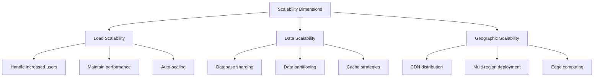

# Building Scalable and Robust Applications

## Overview

Building scalable and robust applications requires careful consideration of architecture, code quality, performance, and maintainability. This section explores the principles and practices that enable applications to grow gracefully while maintaining reliability and performance.

## Table of Contents

- [Scalability Principles](#scalability-principles)
- [Robustness Fundamentals](#robustness-fundamentals)
- [Architecture Patterns](#architecture-patterns)
- [Code Quality Practices](#code-quality-practices)
- [Performance Optimization](#performance-optimization)
- [Error Handling Strategies](#error-handling-strategies)
- [Testing Strategies](#testing-strategies)
- [Monitoring and Observability](#monitoring-and-observability)
- [Deployment and DevOps](#deployment-and-devops)

## Scalability Principles

### Vertical vs Horizontal Scaling

```swift
// Vertical Scaling (Scale Up)
// Increase resources on single machine
class VerticalScaler {
    // Single powerful server handling all requests
    func handleRequest(_ request: Request) -> Response {
        // Process on single high-performance machine
        return processOnSingleServer(request)
    }
}

// Horizontal Scaling (Scale Out)
// Distribute across multiple machines
class HorizontalScaler {
    private let servers: [Server]
    private let loadBalancer: LoadBalancer

    func handleRequest(_ request: Request) -> Response {
        let targetServer = loadBalancer.selectServer(for: request)
        return targetServer.process(request)
    }
}
```

### Scalability Dimensions



### Performance Metrics

```swift
struct PerformanceMetrics {
    // Response Time
    let averageResponseTime: TimeInterval    // < 100ms for good UX
    let percentile95ResponseTime: TimeInterval // < 500ms acceptable
    let percentile99ResponseTime: TimeInterval // < 1000ms maximum

    // Throughput
    let requestsPerSecond: Double           // Target RPS
    let concurrentUsers: Int                // Simultaneous users

    // Resource Utilization
    let cpuUsage: Double                    // < 70% average
    let memoryUsage: Double                 // < 80% average
    let diskIO: Double                      // Monitor I/O patterns

    // Error Rates
    let errorRate: Double                   // < 0.1% target
    let timeoutRate: Double                 // < 1% acceptable
}
```

## Robustness Fundamentals

### Fault Tolerance Patterns

```swift
// Circuit Breaker Pattern
class CircuitBreaker {
    enum State {
        case closed     // Normal operation
        case open       // Failing, reject requests
        case halfOpen   // Testing recovery
    }

    private var state: State = .closed
    private var failureCount = 0
    private let failureThreshold = 5
    private let timeoutInterval: TimeInterval = 60

    func execute<T>(_ operation: () throws -> T) throws -> T {
        switch state {
        case .open:
            if shouldAttemptReset() {
                state = .halfOpen
                return try execute(operation)
            }
            throw CircuitBreakerError.serviceUnavailable

        case .halfOpen, .closed:
            do {
                let result = try operation()
                onSuccess()
                return result
            } catch {
                onFailure()
                throw error
            }
        }
    }
}
```

### Graceful Degradation

```swift
// Feature flags for graceful degradation
protocol FeatureToggle {
    func isEnabled(_ feature: Feature) -> Bool
}

class GracefulDegradationService {
    private let featureToggle: FeatureToggle
    private let fallbackService: FallbackService

    func processUserData(_ data: UserData) -> Result<UserProfile, Error> {
        // Primary processing with advanced features
        if featureToggle.isEnabled(.advancedProcessing) {
            return advancedProcessing(data)
        }

        // Fallback to basic processing
        if featureToggle.isEnabled(.basicProcessing) {
            return basicProcessing(data)
        }

        // Ultimate fallback
        return fallbackService.process(data)
    }
}
```

### Resilience Patterns

```swift
// Retry with exponential backoff
struct RetryConfiguration {
    let maxAttempts: Int
    let baseDelay: TimeInterval
    let maxDelay: TimeInterval
    let backoffMultiplier: Double
}

class ResilientService {
    func executeWithRetry<T>(
        _ operation: () async throws -> T,
        config: RetryConfiguration = .default
    ) async throws -> T {
        var attempt = 0
        var delay = config.baseDelay

        while attempt < config.maxAttempts {
            do {
                return try await operation()
            } catch {
                attempt += 1
                if attempt >= config.maxAttempts {
                    throw error
                }

                // Exponential backoff with jitter
                let jitter = Double.random(in: 0...0.1) * delay
                try await Task.sleep(nanoseconds: UInt64((delay + jitter) * 1_000_000_000))

                delay = min(delay * config.backoffMultiplier, config.maxDelay)
            }
        }
    }
}
```

## Architecture Patterns

### Layered Architecture

```swift
// Clean Architecture layers
// Domain Layer (Business Logic)
protocol UserRepository {
    func getUser(id: UserID) async throws -> User
    func saveUser(_ user: User) async throws
}

protocol AuthenticationService {
    func authenticate(credentials: Credentials) async throws -> AuthToken
}

// Application Layer (Use Cases)
class LoginUseCase {
    private let authService: AuthenticationService
    private let userRepository: UserRepository

    func execute(email: String, password: String) async throws -> User {
        let credentials = Credentials(email: email, password: password)
        let token = try await authService.authenticate(credentials: credentials)
        let user = try await userRepository.getUser(id: token.userID)
        return user
    }
}

// Infrastructure Layer (External Dependencies)
class APIAuthenticationService: AuthenticationService {
    func authenticate(credentials: Credentials) async throws -> AuthToken {
        // HTTP request to authentication service
        return try await apiClient.authenticate(credentials)
    }
}

class CoreDataUserRepository: UserRepository {
    func getUser(id: UserID) async throws -> User {
        // Core Data operations
        return try await coreDataStack.fetchUser(id: id)
    }
}
```

### Microservices Considerations

```swift
// Service boundaries and communication
protocol ServiceDiscovery {
    func discover(service: ServiceType) -> ServiceEndpoint
}

protocol InterServiceCommunication {
    func request<T: Codable>(
        _ endpoint: ServiceEndpoint,
        method: HTTPMethod,
        body: T?
    ) async throws -> Data
}

// Event-driven communication
struct EventBus {
    private var subscribers: [EventType: [EventHandler]] = [:]

    func publish(_ event: AppEvent) {
        guard let handlers = subscribers[event.type] else { return }
        handlers.forEach { handler in
            Task { await handler.handle(event) }
        }
    }

    func subscribe(to eventType: EventType, handler: @escaping EventHandler) {
        subscribers[eventType, default: []].append(handler)
    }
}
```

### Modular Architecture

```swift
// Feature modules
// UserProfile module
public struct UserProfileModule {
    public static func assemble(
        dependencies: UserProfileDependencies
    ) -> UserProfileViewController {
        let interactor = UserProfileInteractor(
            userService: dependencies.userService,
            analytics: dependencies.analytics
        )
        let presenter = UserProfilePresenter(interactor: interactor)
        let viewController = UserProfileViewController(presenter: presenter)

        return viewController
    }
}

// Dependency injection container
class DIContainer {
    private var services: [String: Any] = [:]

    func register<T>(_ service: T, for type: T.Type = T.self) {
        let key = String(describing: type)
        services[key] = service
    }

    func resolve<T>(_ type: T.Type = T.self) -> T? {
        let key = String(describing: type)
        return services[key] as? T
    }
}
```

## Code Quality Practices

### SOLID Principles Application

```swift
// Single Responsibility Principle
class UserManager {
    // ❌ Bad: Multiple responsibilities
    func createUser(_ user: User) { /* ... */ }
    func sendEmail(to user: User) { /* ... */ }
    func saveToDatabase(_ user: User) { /* ... */ }
}

// ✅ Good: Single responsibility per class
class UserCreator {
    func createUser(_ user: User) { /* ... */ }
}

class EmailService {
    func sendEmail(to user: User) { /* ... */ }
}

class UserRepository {
    func saveToDatabase(_ user: User) { /* ... */ }
}

// Open/Closed Principle
protocol PaymentProcessor {
    func process(payment: Payment) -> PaymentResult
}

// Extensible without modification
class CreditCardProcessor: PaymentProcessor {
    func process(payment: Payment) -> PaymentResult { /* ... */ }
}

class PayPalProcessor: PaymentProcessor {
    func process(payment: Payment) -> PaymentResult { /* ... */ }
}
```

### Design Patterns Implementation

```swift
// Factory Pattern for object creation
protocol Logger {
    func log(_ message: String, level: LogLevel)
}

class LoggerFactory {
    static func createLogger(type: LoggerType) -> Logger {
        switch type {
        case .console:
            return ConsoleLogger()
        case .file:
            return FileLogger()
        case .remote:
            return RemoteLogger()
        }
    }
}

// Strategy Pattern for algorithms
protocol SortingStrategy {
    func sort<T: Comparable>(_ array: [T]) -> [T]
}

class QuickSortStrategy: SortingStrategy {
    func sort<T: Comparable>(_ array: [T]) -> [T] {
        // Quick sort implementation
        return quickSort(array)
    }
}

class MergeSortStrategy: SortingStrategy {
    func sort<T: Comparable>(_ array: [T]) -> [T] {
        // Merge sort implementation
        return mergeSort(array)
    }
}

class Sorter {
    var strategy: SortingStrategy

    func sort<T: Comparable>(_ array: [T]) -> [T] {
        return strategy.sort(array)
    }
}
```

## Performance Optimization

### Memory Management

```swift
// Weak references to prevent retain cycles
class NetworkManager {
    private weak var delegate: NetworkDelegate?

    func setDelegate(_ delegate: NetworkDelegate) {
        self.delegate = delegate
    }
}

// Value types for performance
struct User {
    let id: UUID
    let name: String
    let email: String
    // Value type - copied when passed around
}

// Reference types when sharing is needed
class UserSession {
    var currentUser: User?
    var authToken: String?

    // Singleton pattern for shared state
    static let shared = UserSession()
    private init() {}
}
```

### Concurrency Optimization

```swift
// Async/await for better performance
class DataLoader {
    private let cache = NSCache<NSString, NSData>()

    func loadData(from url: URL) async throws -> Data {
        let cacheKey = url.absoluteString as NSString

        // Check cache first
        if let cachedData = cache.object(forKey: cacheKey) as Data? {
            return cachedData
        }

        // Load from network
        let (data, _) = try await URLSession.shared.data(from: url)

        // Cache the result
        cache.setObject(data as NSData, forKey: cacheKey)

        return data
    }
}

// Actor for thread-safe state
actor Counter {
    private var value = 0

    func increment() -> Int {
        value += 1
        return value
    }

    func getValue() -> Int {
        return value
    }
}
```

### Database Optimization

```swift
// Efficient data fetching
class OptimizedUserRepository {
    private let database: Database

    // Batch operations
    func saveUsers(_ users: [User]) async throws {
        try await database.performBatch { context in
            for user in users {
                let entity = UserEntity(context: context)
                entity.id = user.id
                entity.name = user.name
                entity.email = user.email
            }
        }
    }

    // Lazy loading with pagination
    func getUsers(limit: Int, offset: Int) async throws -> [User] {
        let request = NSFetchRequest<UserEntity>(entityName: "User")
        request.fetchLimit = limit
        request.fetchOffset = offset

        let entities = try await database.fetch(request)
        return entities.map(User.init)
    }
}
```

## Error Handling Strategies

### Comprehensive Error Types

```swift
// Domain-specific errors
enum AppError: Error {
    case network(NetworkError)
    case authentication(AuthError)
    case validation(ValidationError)
    case database(DatabaseError)
    case unknown(Error)
}

enum NetworkError: Error {
    case noInternet
    case timeout
    case serverError(code: Int)
    case invalidResponse
}

enum ValidationError: Error {
    case requiredField(String)
    case invalidFormat(String)
    case outOfRange(String, min: Any, max: Any)
}
```

### Error Recovery Patterns

```swift
// Result type for better error handling
func authenticateUser(email: String, password: String) -> Result<User, AppError> {
    guard !email.isEmpty else {
        return .failure(.validation(.requiredField("email")))
    }

    guard !password.isEmpty else {
        return .failure(.validation(.requiredField("password")))
    }

    do {
        let user = try performAuthentication(email: email, password: password)
        return .success(user)
    } catch let error as NetworkError {
        return .failure(.network(error))
    } catch {
        return .failure(.unknown(error))
    }
}

// Error recovery with fallbacks
class FallbackAuthenticationService {
    private let primaryService: AuthenticationService
    private let backupService: AuthenticationService

    func authenticate(credentials: Credentials) async throws -> AuthToken {
        do {
            return try await primaryService.authenticate(credentials: credentials)
        } catch {
            // Log primary service failure
            logger.error("Primary auth failed: \(error.localizedDescription)")

            // Attempt backup authentication
            return try await backupService.authenticate(credentials: credentials)
        }
    }
}
```

## Testing Strategies

### Unit Testing Pyramid

```swift
// Unit tests (foundation layer)
class CalculatorTests: XCTestCase {
    func testAddition() {
        let calculator = Calculator()
        XCTAssertEqual(calculator.add(2, 3), 5)
    }

    func testDivisionByZero() {
        let calculator = Calculator()
        XCTAssertThrowsError(try calculator.divide(10, 0))
    }
}

// Integration tests (middle layer)
class UserServiceIntegrationTests: XCTestCase {
    func testUserCreationAndRetrieval() async throws {
        let service = UserService(database: testDatabase)

        let user = User(name: "John Doe", email: "john@example.com")
        let createdUser = try await service.createUser(user)

        let retrievedUser = try await service.getUser(id: createdUser.id)
        XCTAssertEqual(retrievedUser.name, user.name)
        XCTAssertEqual(retrievedUser.email, user.email)
    }
}

// End-to-end tests (top layer)
class UserRegistrationE2ETests: XCTestCase {
    func testCompleteUserRegistrationFlow() async throws {
        // Launch app
        let app = XCUIApplication()
        app.launch()

        // Navigate to registration
        app.buttons["Sign Up"].tap()

        // Fill registration form
        let nameField = app.textFields["Name"]
        nameField.tap()
        nameField.typeText("Jane Smith")

        let emailField = app.textFields["Email"]
        emailField.tap()
        emailField.typeText("jane@example.com")

        // Submit form
        app.buttons["Create Account"].tap()

        // Verify success
        XCTAssertTrue(app.staticTexts["Welcome, Jane Smith!"].exists)
    }
}
```

### Test-Driven Development

```swift
// TDD example: Implementing a shopping cart
class ShoppingCartTests: XCTestCase {
    func testEmptyCartTotalIsZero() {
        let cart = ShoppingCart()
        XCTAssertEqual(cart.total, 0)
    }

    func testAddingItemIncreasesTotal() {
        let cart = ShoppingCart()
        let item = CartItem(name: "Apple", price: 1.50)
        cart.addItem(item)
        XCTAssertEqual(cart.total, 1.50)
    }

    func testAddingMultipleItemsCalculatesCorrectTotal() {
        let cart = ShoppingCart()
        cart.addItem(CartItem(name: "Apple", price: 1.50))
        cart.addItem(CartItem(name: "Orange", price: 2.00))
        XCTAssertEqual(cart.total, 3.50)
    }

    func testRemovingItemDecreasesTotal() {
        let cart = ShoppingCart()
        let item = CartItem(name: "Apple", price: 1.50)
        cart.addItem(item)
        cart.removeItem(item)
        XCTAssertEqual(cart.total, 0)
    }
}

// Implementation driven by tests
class ShoppingCart {
    private var items: [CartItem] = []

    var total: Double {
        items.reduce(0) { $0 + $1.price }
    }

    func addItem(_ item: CartItem) {
        items.append(item)
    }

    func removeItem(_ item: CartItem) {
        items.removeAll { $0.id == item.id }
    }
}
```

## Monitoring and Observability

### Metrics Collection

```swift
// Application metrics
struct ApplicationMetrics {
    let activeUsers: Counter
    let requestCount: Counter
    let responseTime: Histogram
    let errorCount: Counter
    let memoryUsage: Gauge
    let cpuUsage: Gauge
}

// Usage example
class MetricsCollector {
    private let metrics = ApplicationMetrics(
        activeUsers: Counter(name: "active_users"),
        requestCount: Counter(name: "http_requests_total"),
        responseTime: Histogram(name: "http_request_duration_seconds"),
        errorCount: Counter(name: "http_requests_errors_total"),
        memoryUsage: Gauge(name: "memory_usage_bytes"),
        cpuUsage: Gauge(name: "cpu_usage_percent")
    )

    func recordRequest(duration: TimeInterval, statusCode: Int) {
        metrics.requestCount.increment()
        metrics.responseTime.observe(duration)

        if statusCode >= 400 {
            metrics.errorCount.increment()
        }
    }
}
```

### Logging Strategy

```swift
// Structured logging
struct LogEntry {
    let timestamp: Date
    let level: LogLevel
    let message: String
    let context: [String: Any]
    let userID: UUID?
    let sessionID: UUID?
    let requestID: UUID?
}

enum LogLevel: String {
    case debug, info, warning, error, critical
}

class StructuredLogger {
    func log(
        level: LogLevel,
        message: String,
        context: [String: Any] = [:],
        file: String = #file,
        function: String = #function,
        line: Int = #line
    ) {
        let entry = LogEntry(
            timestamp: Date(),
            level: level,
            message: message,
            context: context,
            userID: currentUserID,
            sessionID: currentSessionID,
            requestID: currentRequestID
        )

        // Send to logging service
        loggingService.send(entry)
    }
}

// Usage
logger.log(
    level: .info,
    message: "User login successful",
    context: ["loginMethod": "email", "deviceType": "iPhone"]
)
```

### Health Checks

```swift
// Application health monitoring
protocol HealthCheck {
    var name: String { get }
    func check() async -> HealthStatus
}

enum HealthStatus {
    case healthy
    case degraded(reason: String)
    case unhealthy(reason: String)
}

class HealthChecker {
    private let checks: [HealthCheck]

    func performHealthCheck() async -> OverallHealth {
        var results: [String: HealthStatus] = [:]

        await withTaskGroup(of: (String, HealthStatus).self) { group in
            for check in checks {
                group.addTask {
                    let status = await check.check()
                    return (check.name, status)
                }
            }

            for await (name, status) in group {
                results[name] = status
            }
        }

        return OverallHealth(results: results)
    }
}

// Specific health checks
class DatabaseHealthCheck: HealthCheck {
    let name = "database"

    func check() async -> HealthStatus {
        do {
            try await database.ping()
            return .healthy
        } catch {
            return .unhealthy(reason: error.localizedDescription)
        }
    }
}
```

## Deployment and DevOps

### CI/CD Pipeline

```yaml
# .github/workflows/ci-cd.yml
name: CI/CD Pipeline

on:
  push:
    branches: [ main, develop ]
  pull_request:
    branches: [ main ]

jobs:
  test:
    runs-on: macos-latest
    steps:
      - uses: actions/checkout@v3
      - name: Select Xcode version
        run: sudo xcode-select -s /Applications/Xcode_14.2.app
      - name: Run tests
        run: xcodebuild test -project MyApp.xcodeproj -scheme MyApp -destination 'platform=iOS Simulator,name=iPhone 14'

  build:
    needs: test
    runs-on: macos-latest
    steps:
      - uses: actions/checkout@v3
      - name: Build for release
        run: xcodebuild archive -project MyApp.xcodeproj -scheme MyApp -archivePath ./build/MyApp.xcarchive
      - name: Upload to TestFlight
        run: xcodebuild -exportArchive -archivePath ./build/MyApp.xcarchive -exportPath ./build -exportOptionsPlist exportOptions.plist

  deploy:
    needs: build
    runs-on: ubuntu-latest
    if: github.ref == 'refs/heads/main'
    steps:
      - name: Deploy to production
        run: echo "Deploy to App Store Connect"
```

### Blue-Green Deployment

```swift
// Feature flags for blue-green deployment
class FeatureFlagManager {
    private let environment: DeploymentEnvironment

    func isFeatureEnabled(_ feature: FeatureFlag) -> Bool {
        switch environment {
        case .blue:
            return blueFeatures.contains(feature)
        case .green:
            return greenFeatures.contains(feature)
        }
    }
}

// Database migration strategy
class DatabaseMigrator {
    func migrate(from: Version, to: Version) async throws {
        // Create backup
        try await createBackup()

        // Run migrations in transaction
        try await database.transaction { context in
            for migration in migrations(from: from, to: to) {
                try await migration.run(in: context)
            }
        }

        // Verify migration
        try await verifyMigration()
    }
}
```

### Infrastructure as Code

```swift
// Terraform-like configuration (conceptual)
struct InfrastructureConfig {
    let environments: [EnvironmentConfig]

    struct EnvironmentConfig {
        let name: String
        let instanceCount: Int
        let instanceType: String
        let regions: [String]
        let databaseConfig: DatabaseConfig
        let monitoringConfig: MonitoringConfig
    }
}

// Automated scaling
class AutoScaler {
    private let metricsProvider: MetricsProvider
    private let scalingPolicy: ScalingPolicy

    func evaluateScaling() async {
        let currentMetrics = await metricsProvider.getCurrentMetrics()

        if scalingPolicy.shouldScaleUp(metrics: currentMetrics) {
            await scaleUp()
        } else if scalingPolicy.shouldScaleDown(metrics: currentMetrics) {
            await scaleDown()
        }
    }
}
```

## Summary

Building scalable and robust applications requires a holistic approach that encompasses:

1. **Scalability Principles**: Understanding vertical vs horizontal scaling, performance metrics, and growth planning
2. **Robustness Fundamentals**: Implementing fault tolerance, graceful degradation, and resilience patterns
3. **Architecture Patterns**: Choosing appropriate patterns like layered architecture, microservices, and modular design
4. **Code Quality**: Applying SOLID principles, design patterns, and clean code practices
5. **Performance Optimization**: Memory management, concurrency, and database optimization
6. **Error Handling**: Comprehensive error types and recovery strategies
7. **Testing**: Unit, integration, and end-to-end testing with TDD
8. **Monitoring**: Metrics collection, structured logging, and health checks
9. **DevOps**: CI/CD pipelines, blue-green deployments, and infrastructure as code

The key to success lies in balancing these concerns while maintaining code maintainability and team productivity. Regular monitoring, testing, and iterative improvement are essential for long-term success.
