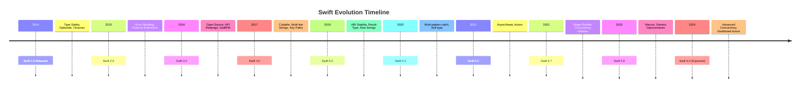

# History and Evolution of Swift

## Overview

Swift's journey from a research project to one of the world's most popular programming languages represents a remarkable evolution in programming language design. This section explores Swift's origins, major milestones, and the transformative features that have shaped its development.

## Table of Contents

- [Origins and Development](#origins-and-development)
- [Swift 1.0: The Beginning](#swift-10-the-beginning)
- [Swift 2.x: Stability and Refinement](#swift-2x-stability-and-refinement)
- [Swift 3.x: Open Source and API Design](#swift-3x-open-source-and-api-design)
- [Swift 4.x: String Processing and Serialization](#swift-4x-string-processing-and-serialization)
- [Swift 5.x: ABI Stability and Performance](#swift-5x-abi-stability-and-performance)
- [Swift 6.x: Concurrency and Beyond](#swift-6x-concurrency-and-beyond)
- [Major Language Features Timeline](#major-language-features-timeline)
- [Community and Ecosystem Growth](#community-and-ecosystem-growth)
- [Impact on Programming](#impact-on-programming)

## Origins and Development

### The Need for a New Language

```swift
// The iOS development landscape in 2010
// Objective-C was the primary language for iOS/macOS development

// Objective-C example (circa 2010)
@interface MyViewController : UIViewController {
    NSString *title;
    NSArray *items;
}
- (void)viewDidLoad;
@end

@implementation MyViewController
- (void)viewDidLoad {
    [super viewDidLoad];
    self.title = @"Hello World";
    self.items = [NSArray arrayWithObjects:@"Item 1", @"Item 2", nil];
}
@end

// Challenges with Objective-C:
// - Verbose syntax
// - Manual memory management
// - Complex pointer arithmetic
// - Limited modern language features
// - Steep learning curve for newcomers
```

### Chris Lattner's Vision

```swift
// Chris Lattner's goals for Swift (2010-2013):
// 1. Modern syntax with type safety
// 2. Performance comparable to C++
// 3. Interoperability with Objective-C
// 4. Memory safety without garbage collection
// 5. Easy to learn and use

// Early Swift prototype concepts (internal Apple research):
enum Optional<T> {
    case None
    case Some(T)
}

func findUser(id: Int) -> Optional<User> {
    // Early pattern matching concepts
    return .None  // Simplified for illustration
}

// Automatic Reference Counting (ARC) instead of manual retain/release
class MyClass {
    var name: String

    init(name: String) {
        self.name = name
        // ARC automatically manages memory
    }
}
```

### Project Beginnings

- **Started**: 2010 as internal Apple project
- **Lead Developer**: Chris Lattner (creator of LLVM/Clang)
- **Initial Goal**: Replace Objective-C for iOS/macOS development
- **Secret Development**: Code-named "Project Chris" internally
- **Key Influences**:
  - Rust (memory safety without GC)
  - Haskell (type system and functional programming)
  - Ruby/Python (clean syntax)
  - C# (modern language features)
  - Objective-C (Cocoa frameworks integration)

## Swift 1.0: The Beginning

### Release Timeline

- **WWDC 2014**: Announced June 2, 2014
- **Beta Releases**: June 2014 - September 2014
- **Stable Release**: September 9, 2014 (Xcode 6.0)
- **Platform Support**: iOS 8.0+, macOS 10.9.0+

### Groundbreaking Features

```swift
// 1. Type Safety and Type Inference
let message = "Hello, World!"        // Inferred String
let count: Int = 42                  // Explicit Int
let isValid = true                   // Inferred Bool

// 2. Optionals (revolutionary for mainstream languages)
var name: String?                    // Can be nil
var age: Int? = 25                   // Can be nil

// Safe unwrapping
if let actualName = name {
    print("Hello, \(actualName)")
} else {
    print("Name is unknown")
}

// 3. Modern Collection Types
let numbers = [1, 2, 3, 4, 5]        // Array
let colors = ["red": "#FF0000", "blue": "#0000FF"]  // Dictionary

// Functional programming support
let doubled = numbers.map { $0 * 2 }  // [2, 4, 6, 8, 10]
let evens = numbers.filter { $0 % 2 == 0 }  // [2, 4]
let sum = numbers.reduce(0, +)       // 15

// 4. Tuples
let person = (name: "John", age: 30, city: "New York")
print("\(person.name) is \(person.age) years old")  // John is 30 years old

// 5. Ranges
let array = [1, 2, 3, 4, 5]
let slice = array[1...3]              // [2, 3, 4]
let halfOpen = array[..<3]            // [1, 2, 3]
```

### Swift vs Objective-C Comparison

```swift
// Objective-C (verbose)
NSString *name = @"John";
NSNumber *age = @30;
NSDictionary *person = @{@"name": name, @"age": age};

// Swift (concise)
let name = "John"
let age = 30
let person = ["name": name, "age": age]
```

### Initial Challenges

- **Source Compatibility**: Required bridging with Objective-C
- **Performance**: Initial versions slower than optimized Objective-C
- **Tooling**: Xcode integration was evolving
- **Migration**: Large existing codebases needed gradual migration

## Swift 2.x: Stability and Refinement

### Swift 2.0 (2015)

**Key Additions:**
- Error handling with `try/catch/throw`
- Protocol extensions
- Guard statements
- Availability checking

```swift
// Error Handling
enum NetworkError: Error {
    case invalidURL
    case noData
    case serverError(code: Int)
}

func fetchUser(id: Int) throws -> User {
    guard id > 0 else {
        throw NetworkError.invalidURL
    }

    // Simulate network call
    return User(id: id, name: "John")
}

do {
    let user = try fetchUser(id: 123)
    print("User: \(user.name)")
} catch NetworkError.invalidURL {
    print("Invalid user ID")
} catch {
    print("Other error: \(error)")
}

// Protocol Extensions
protocol Printable {
    func description() -> String
}

extension Printable {
    func printDescription() {
        print(description())
    }
}

extension String: Printable {
    func description() -> String {
        return "String: \(self)"
    }
}

"hello".printDescription()  // "String: hello"

// Guard Statements
func processUser(name: String?, age: Int?) {
    guard let name = name else {
        print("Name is required")
        return
    }

    guard let age = age, age >= 18 else {
        print("Must be 18 or older")
        return
    }

    print("Processing \(name), age \(age)")
}
```

### Swift 2.1-2.3 (2015-2016)

- Generic type improvements
- Performance optimizations
- Better Objective-C interoperability
- Enhanced pattern matching

## Swift 3.x: Open Source and API Design

### Swift 3.0 (2016)

**Major Changes:**
- Massive API redesign for consistency
- Open source release (December 2015)
- Linux support
- Package Manager (SwiftPM)

```swift
// Swift 2.x API
"hello world".uppercaseString
"hello world".stringByReplacingOccurrencesOfString("world", withString: "Swift")
array.sortInPlace()

// Swift 3.x API (consistent naming)
"hello world".uppercased()
"hello world".replacingOccurrences(of: "world", with: "Swift")
array.sort()
```

### Open Source Release

**December 3, 2015**: Swift becomes open source
- Repository: https://github.com/apple/swift
- Linux support announced
- Community-driven development begins

### Swift Package Manager

```swift
// Package.swift (Swift 3+)
import PackageDescription

let package = Package(
    name: "MyLibrary",
    dependencies: [
        .Package(url: "https://github.com/vapor/vapor.git", majorVersion: 1)
    ]
)

// Usage
import PackageDescription

let package = Package(
    name: "MyApp",
    dependencies: [
        .package(url: "https://github.com/vapor/vapor.git", .upToNextMajor(from: "4.0.0"))
    ],
    targets: [
        .target(name: "MyApp", dependencies: ["Vapor"]),
        .testTarget(name: "MyAppTests", dependencies: ["MyApp"])
    ]
)
```

### Linux Compatibility

```swift
// Cross-platform file operations
import Foundation

#if os(Linux)
    // Linux-specific code
    let homePath = NSHomeDirectory()
#else
    // macOS/iOS specific code
    let homePath = NSHomeDirectoryForUser(NSUserName())!
#endif

// Unified API across platforms
let fileManager = FileManager.default
let documentsURL = fileManager.urls(for: .documentDirectory, in: .userDomainMask)[0]
```

## Swift 4.x: String Processing and Serialization

### Swift 4.0 (2017)

**Major Features:**
- Improved String API
- Codable protocol for serialization
- Multi-line string literals
- Key paths
- One-sided ranges

```swift
// Enhanced Strings
let greeting = "Hello"
let name = "World"
let message = "\(greeting), \(name)!"  // Same as before

// Multi-line strings
let html = """
    <html>
        <body>
            <h1>\(greeting), \(name)!</h1>
        </body>
    </html>
    """

// Codable Protocol
struct User: Codable {
    let id: Int
    let name: String
    let email: String
}

let user = User(id: 1, name: "John", email: "john@example.com")

// Encode to JSON
let encoder = JSONEncoder()
let data = try encoder.encode(user)
let jsonString = String(data: data, encoding: .utf8)!
// {"id":1,"name":"John","email":"john@example.com"}

// Decode from JSON
let decoder = JSONDecoder()
let decodedUser = try decoder.decode(User.self, from: data)

// Key Paths
let userNameKeyPath = \User.name
let userName = user[keyPath: userNameKeyPath]  // "John"

// One-sided ranges
let array = [1, 2, 3, 4, 5]
let firstThree = array[..<3]    // [1, 2, 3]
let lastTwo = array[3...]       // [4, 5]
```

### Swift 4.1-4.2 (2018)

- Build performance improvements
- Hashable protocol synthesis
- Conditional conformance
- App thinning support

```swift
// Conditional Conformance
struct Stack<Element> {
    private var elements: [Element] = []

    mutating func push(_ element: Element) {
        elements.append(element)
    }

    mutating func pop() -> Element? {
        elements.popLast()
    }
}

// Stack of equatable elements is equatable
extension Stack: Equatable where Element: Equatable {
    static func == (lhs: Stack<Element>, rhs: Stack<Element>) -> Bool {
        lhs.elements == rhs.elements
    }
}
```

## Swift 5.x: ABI Stability and Performance

### Swift 5.0 (2019)

**ABI Stability Achieved:**
- Binary compatibility across versions
- Stable Swift runtime
- Faster app startup times
- Smaller app sizes

**Key Features:**
- Raw strings
- Result type in standard library
- Custom string interpolation
- Dynamic member lookup

```swift
// Raw Strings
let regex = #"(\d{3})-(\d{3})-(\d{4})"#  // No escaping needed
let path = #"C:\Users\John\Documents"#   // Backslashes as-is

// Result Type
enum NetworkError: Error {
    case invalidURL, noData
}

func fetchData(from url: String) -> Result<Data, NetworkError> {
    guard let url = URL(string: url) else {
        return .failure(.invalidURL)
    }
    // Simulate fetch
    return .success(Data())
}

// Custom String Interpolation
struct HexColor {
    let red, green, blue: UInt8

    init(red: UInt8, green: UInt8, blue: UInt8) {
        self.red = red
        self.green = green
        self.blue = blue
    }
}

extension String.StringInterpolation {
    mutating func appendInterpolation(_ color: HexColor) {
        let hex = String(format: "#%02X%02X%02X", color.red, color.green, color.blue)
        appendLiteral(hex)
    }
}

let color = HexColor(red: 255, green: 128, blue: 0)
print("The color is \(color)")  // "The color is #FF8000"
```

### Swift 5.1-5.9 (2019-2023)

- Property wrappers
- Opaque result types
- Module stability
- Concurrency improvements
- Performance optimizations

```swift
// Property Wrappers (Swift 5.1)
@propertyWrapper
struct UserDefault<T> {
    let key: String
    let defaultValue: T

    var wrappedValue: T {
        get {
            UserDefaults.standard.object(forKey: key) as? T ?? defaultValue
        }
        set {
            UserDefaults.standard.set(newValue, forKey: key)
        }
    }
}

struct Settings {
    @UserDefault(key: "theme", defaultValue: "light")
    var theme: String

    @UserDefault(key: "fontSize", defaultValue: 14)
    var fontSize: Int
}
```

## Swift 6.x: Concurrency and Beyond

### Swift 6.0 (Expected 2024)

**Major Focus: Structured Concurrency**
- Actor isolation improvements
- Async sequences
- Distributed actors
- Improved Sendable checking

```swift
// Async Sequences (concept preview)
for await temperature in weatherStation.temperatureStream {
    updateUI(temperature: temperature)
}

// Distributed Actors
distributed actor WeatherService {
    distributed func getWeather(for city: String) -> Weather {
        // Can be called across network boundaries
        return await fetchWeatherData(for: city)
    }
}
```

### Future Directions

- **Swift 7+**: Focus on advanced generics, ownership, and performance
- **Server-side Swift**: Continued ecosystem growth
- **Cross-platform**: Enhanced Windows/Linux support
- **AI/ML Integration**: Swift for TensorFlow evolution
- **WebAssembly**: Browser-based Swift applications

## Major Language Features Timeline



## Community and Ecosystem Growth

### Package Ecosystem

```swift
// SwiftPM Package Resolution
// From 2016: Basic dependency management
.package(url: "https://github.com/Alamofire/Alamofire.git", .upToNextMajor(from: "5.0.0"))

// Modern: Advanced version resolution
.package(url: "https://github.com/Alamofire/Alamofire.git", .upToNextMinor(from: "5.8.0")),
.package(url: "https://github.com/ReactiveX/RxSwift.git", .exact("6.5.0")),
.package(url: "https://github.com/SnapKit/SnapKit.git", "5.6.0"..<"6.0.0"),
```

### Server-Side Swift

```swift
// Vapor Framework (2016-present)
// From basic routing
app.get("hello") { req in
    return "Hello, world!"
}

// To full-featured web framework
app.get("api", "users", ":id") { req -> EventLoopFuture<User> in
    guard let id = req.parameters.get("id", as: UUID.self) else {
        throw Abort(.badRequest)
    }
    return User.find(id, on: req.db)
        .unwrap(or: Abort(.notFound))
}
```

### Community Contributions

- **Swift Evolution Process**: Community-driven language evolution
- **Swift Forums**: Active discussion and proposal review
- **Swift.org**: Official documentation and resources
- **Meetups and Conferences**: WWDC, SwiftConf, try! Swift
- **Open Source Projects**: 1000+ Swift packages on GitHub

## Impact on Programming

### Industry Adoption

```swift
// Swift's influence on other languages
// Optional types (now in Kotlin, C#, TypeScript)
let result: String? = maybeGetString()

// Type inference improvements
let numbers = [1, 2, 3]  // Type inferred
let sum = numbers.reduce(0, +)  // Functional programming

// Protocol-oriented programming influence
protocol Drawable {
    func draw()
}

extension Circle: Drawable {
    func draw() { /* implementation */ }
}
```

### Educational Impact

- **Lower Barrier to Entry**: Modern syntax attracts new developers
- **Type Safety**: Reduces runtime errors, improves code quality
- **Playgrounds**: Interactive learning environment
- **Open Source**: Transparent language development

### Performance Evolution

```swift
// Performance improvements over versions
// Swift 1.0: ~2-3x slower than Objective-C
// Swift 2.0: Comparable performance
// Swift 3.0: Often faster than Objective-C
// Swift 5.0+: ABI stable, predictable performance

// Benchmark comparison (conceptual)
struct PerformanceMetrics {
    let swift1_0: Double = 2.3  // 2.3x slower than Obj-C
    let swift2_0: Double = 1.0  // Comparable to Obj-C
    let swift5_0: Double = 0.8  // 20% faster than Obj-C
}
```

### Future Legacy

Swift's evolution demonstrates:
- **Iterative Improvement**: Regular releases with backward compatibility
- **Community Involvement**: Open source drives innovation
- **Cross-Platform Expansion**: From iOS-only to multi-platform
- **Modern Language Design**: Influences other languages
- **Long-term Vision**: ABI stability ensures lasting investment

## Summary

Swift's evolution from a secretive Apple project to a cornerstone of modern programming represents a paradigm shift in language design:

1. **2014**: Swift 1.0 introduces modern syntax and type safety
2. **2015-2016**: Swift 2-3 focus on stability and open source
3. **2017-2019**: Swift 4-5 achieve API stability and performance
4. **2020+**: Swift 5.x+ emphasizes concurrency and ecosystem growth

Key achievements:
- **Type Safety**: Compile-time guarantees prevent runtime errors
- **Performance**: Competitive with C++ and Objective-C
- **Developer Experience**: Modern syntax and tooling
- **Cross-Platform**: Runs on iOS, macOS, Linux, Windows
- **Open Source**: Community-driven development
- **ABI Stability**: Predictable binary compatibility

Swift's success demonstrates that modern language design can balance safety, performance, and developer productivity while maintaining broad platform support and community engagement.
