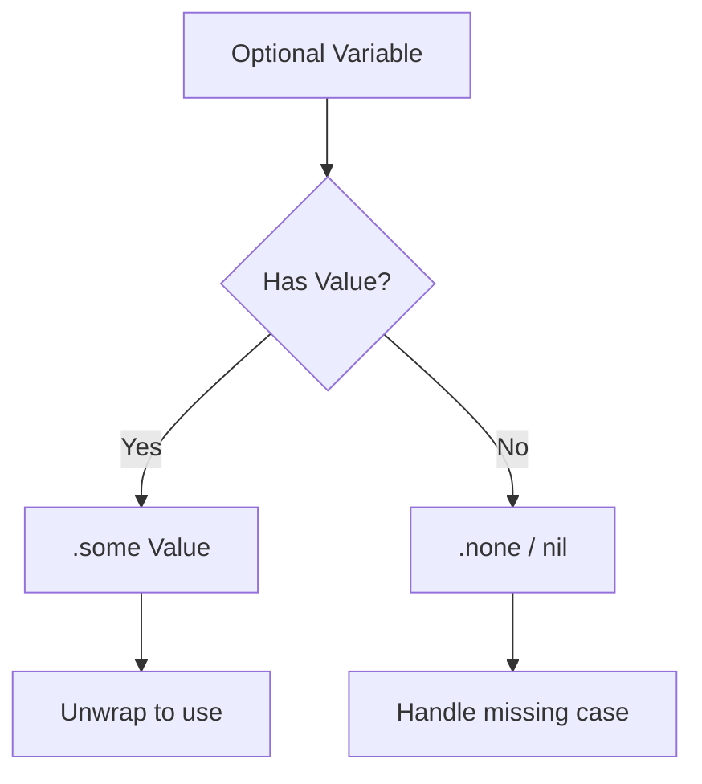

# Optionals in Swift

Swift **Optionals** are a powerful type that represents either a value of a specific type or the absence of a value (`nil`). They are a core safety feature of the language, designed to eliminate "null pointer" errors common in other languages.

## 1. What is an Optional?
An optional is an enum with two cases:
- `.some(Value)`: Contains a value.
- `.none`: Represents the absence of a value (written as `nil`).

```swift
var name: String? = "Antigravity" // .some("Antigravity")
name = nil // .none
```

## 2. Why Use Optionals?
- **Explicit Intent**: You know exactly which variables can be missing.
- **Compiler Safety**: You cannot use an optional value directly; you must "unwrap" it first.
- **Modern Paradigms**: Enables clean functional patterns like `map` and `flatMap` on missing values.

## 3. Key Concepts in this Section

### Safe Unwrapping
Techniques to extract the value if it exists:
- **Optional Binding**: `if let` and `guard let`.
- **Nil Coalescing**: Providing a default value using `??`.
- **Optional Chaining**: Safely calling methods on an optional value.

### Unsafe Unwrapping
Techniques that can crash if the value is missing:
- **Forced Unwrapping**: Using `!`.
- **Implicitly Unwrapped Optionals**: Declared with `!`, used like normal variables.

## 4. Logical Flow of Optionals


> [!IMPORTANT]
> In Swift, `nil` is not a pointer. It is the absence of a value of a certain type. Optionals of any type can be set to `nil`, not just classes.
