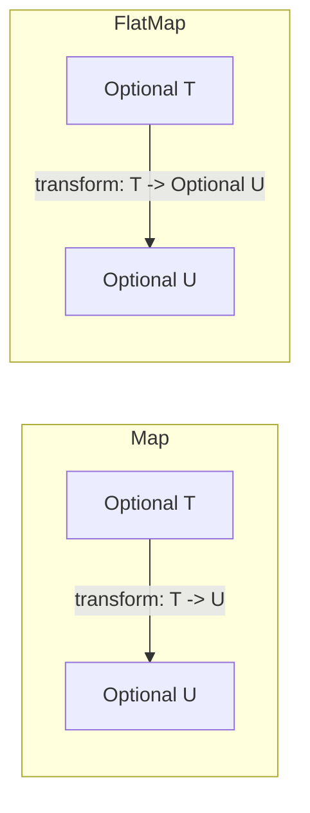

# Comparison of Map vs. FlatMap for Optionals

Both `map` and `flatMap` are used to transform the value inside an optional, but they handle the return type of the transformation closure differently.

## 1. `map`
`map` takes a closure that transforms the value. It then wraps the result back into an optional.

- **If the closure returns `T`**: `map` returns `T?`.
- **If the closure returns `U?`**: `map` returns `U??` (a nested optional).

```swift
let string: String? = "123"
let result = string.map { Int($0) } 
// result is Int?? because Int($0) returns an optional
```

## 2. `flatMap`
`flatMap` is used when the transformation closure itself returns an optional. It "flattens" the result so you don't end up with nested optionals.

- **If the closure returns `U?`**: `flatMap` returns `U?`.

```swift
let string: String? = "123"
let result = string.flatMap { Int($0) } 
// result is Int? (much easier to work with!)
```

## 3. Comparison Table

| Feature | `map` | `flatMap` |
| :--- | :--- | :--- |
| **Closure Return Type** | Any type `T` | Optional type `U?` |
| **Result Type** | Always wrapped: `T?` | Flattened: `U?` |
| **Best Use Case** | Changing data (e.g., String to Int) | Chaining optional operations |

## 4. Visual Comparison


## 5. Recommendation
- Use **`map`** for simple transformations where the output is guaranteed if the input exists.
- Use **`flatMap`** when the transformation itself might fail (return `nil`).

> [!TIP]
> If you find yourself having to unwrap an optional twice (e.g., `if let nested = outer, let value = nested`), you should probably have used `flatMap` earlier in the chain.
