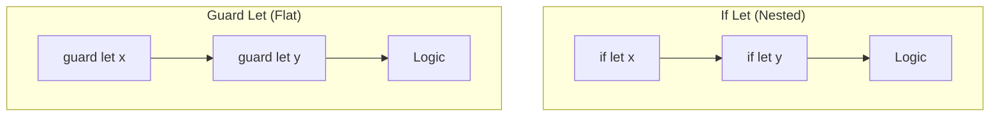

# `guard let` for Early Exit and Preconditions

The `guard` statement is a powerful tool for requirements management within a scope. When used with `let` to unwrap an optional, it serves as a "gatekeeper" that ensures a value exists before the code proceeds.

## 1. Basic Syntax
Unlike `if let`, the constants defined in a `guard let` are available for the **rest of the scope** after the `guard` statement.

```swift
func greet(name: String?) {
    guard let unwrappedName = name else {
        print("No name provided!")
        return // Must exit scope (return, break, continue, or throw)
    }
    
    // unwrappedName is available here!
    print("Hello, \(unwrappedName)")
}
```

## 2. Why Use `guard` instead of `if`?
- **Avoids Deep Nesting**: Prevents the "Pyramid of Doom" where code is nested inside multiple `if let` blocks.
- **Improved Readability**: The "Happy Path" remains at the top level of the function.
- **Explicit Requirements**: It communicates that the unwrap is a prerequisite for the function to work correctly.

## 3. The `else` Block Requirements
The `else` block of a `guard` statement **must** exit the current scope. This is enforced by the compiler.
- In a function: `return` or `throw`.
- In a loop: `break` or `continue`.
- Anywhere: `fatalError()`.

## 4. Multiple Conditions
You can combine multiple unwraps and boolean conditions in a single `guard`.

```swift
guard let user = currentUser, user.isLoggedIn, let token = sessionToken else {
    redirectToLogin()
    return
}
// Logic using 'user' and 'token'
```

## 5. Comparison: If vs. Guard


> [!TIP]
> Use `guard let` at the top of your functions to handle dependencies. It keeps your main logic clean and clearly separated from error handling.
