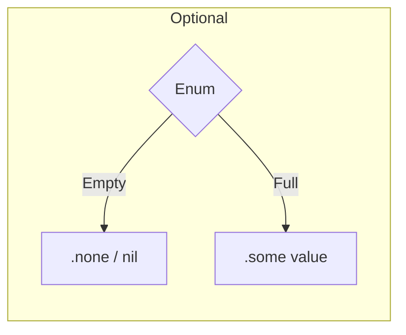

# `.none` (Equivalent to `nil`)

In Swift, `nil` is actually syntactic sugar for the `.none` case of the `Optional` enumeration. Understanding this underlying structure helps clarify how optionals behave and how they interact with pattern matching.

## 1. The Optional Enum
An optional is defined internally like this:

```swift
enum Optional<Wrapped> {
    case none
    case some(Wrapped)
}
```

## 2. Using `.none` explicitly
While `nil` is the idiomatic way to write it, you can use `.none` anywhere you would use `nil`.

```swift
var age: Int? = .none // same as = nil
```

## 3. Pattern Matching with `.none`
Using `.none` is particularly useful in `switch` statements or when you want to avoid the ambiguity that might come with the `nil` keyword in complex generics.

```swift
let result: Int? = nil

switch result {
case .some(let value):
    print("Found value: \(value)")
case .none:
    print("No value found.")
}
```

## 4. Difference from NULL
In C or Objective-C, `NULL` is a pointer to a memory address that points to nothing. In Swift:
- `nil` is **not a pointer**.
- It is a value that represents the **absence** of another value.
- It can be used for any type, including `Int`, `Structs`, and `Enums`, not just reference types (classes).

## 5. Visual Representation


> [!TIP]
> Use `nil` for everyday code as it's more readable. Reserved `.none` for pattern matching or specific situations where you are working with the `Optional` enum directly.
