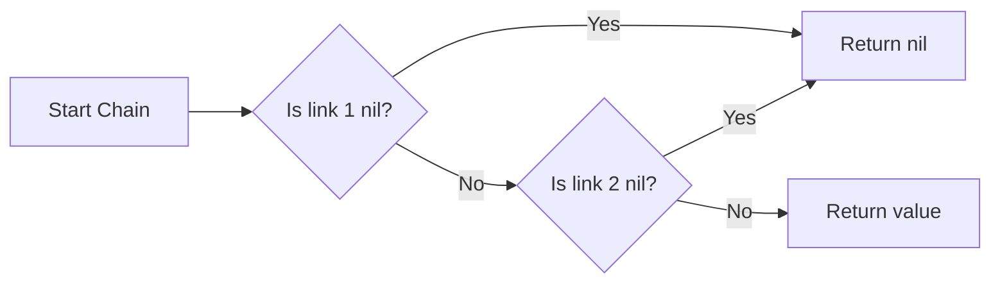

# Optional Chaining (`?.`)

**Optional Chaining** is a process for querying and calling properties, methods, and subscripts on an optional that might currently be `nil`. If the optional contains a value, the property call succeeds; if the optional is `nil`, the call returns `nil`.

## 1. How it Works
You place a `?` after the optional value on which you wish to call a property, method or subscript.

```swift
class Person {
    var job: Job?
}
class Job {
    var title: String = "Engineer"
}

let person = Person()

// Safe access
let title = person.job?.title
// title is String? (contains nil because job is nil)
```

## 2. The Result is Always Optional
Even if the property you are accessing is non-optional (like `title` above), the result of an optional chain is ALWAYS an optional. This is because any part of the chain could fail.

## 3. Silent Failure
One of the key benefits of optional chaining is that it fails **silently**. Unlike forced unwrapping (`!`), it won't crash your app if it encounters a `nil` middleman.

## 4. Multiple Levels of Chaining
You can chain many properties together. The first `nil` encountered stops the evaluation of the rest of the chain.

```swift
let zipCode = user?.address?.zipCode
```

## 5. Logic Diagram


> [!TIP]
> Use optional chaining when you want to "attempt" to get a value but don't want to write complicated `if let` blocks for every intermediate object.
